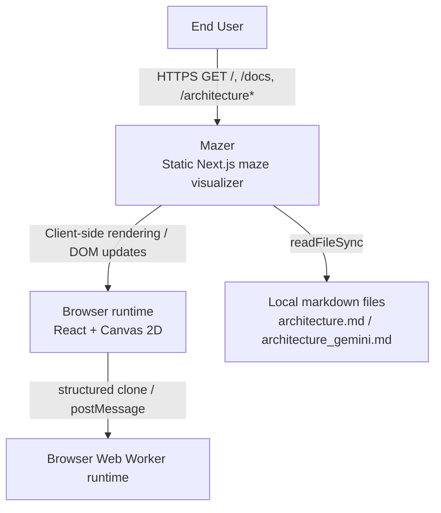
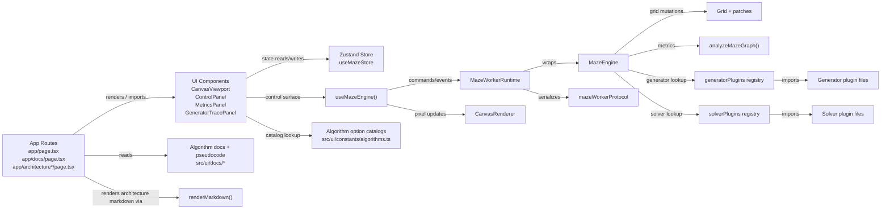
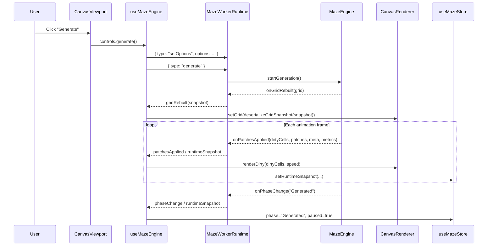
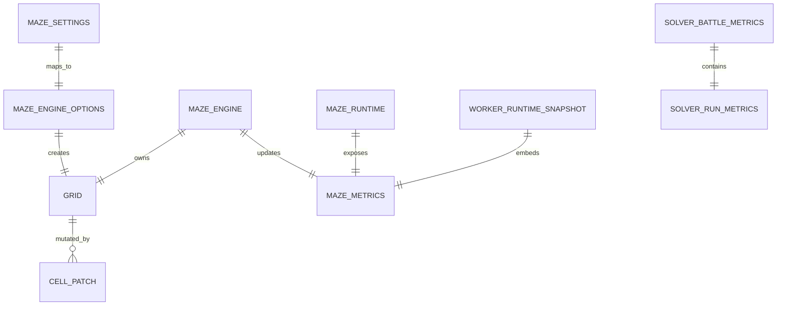

# Mazer Architecture

## 1. Project Overview

`Mazer` is a deterministic maze generation and solving visualizer built as a Next.js App Router application with a React client, a canvas renderer, and a worker-backed execution path. The functional core of the system is a large plugin catalog of maze generators and solvers, each exposed through shared interfaces and stepped incrementally so the UI can animate algorithm progress instead of jumping directly to the final state. The visible users are people exploring or comparing maze algorithms through the browser UI, while the code also supports internal documentation routes that expose algorithm metadata and architectural notes.

[INFERRED]: The business domain is developer tooling / educational visualization rather than transactional SaaS, because the repository contains no account system, billing, persistence, or business workflow code, but it does contain rich algorithm catalogs, pseudocode traces, and architecture-documentation routes (`README.md:3`, `app/docs/page.tsx:144-219`, `src/ui/docs/algorithmDocs.ts:17-220`).

[INFERRED]: Scale and tenancy are browser-local and single-session. The application exports statically (`next.config.ts:3-6`), keeps runtime state in memory with Zustand (`src/ui/store/mazeStore.ts:144-147`), stores maze state in typed arrays (`src/core/grid.ts:53-61`), and does not define any server-side database, authentication, or tenant partitioning.

Concrete finding: the product surface is entirely centered on local maze execution, visualization, and documentation; no multi-user or backend service behavior is present in the codebase.

## 2. Tech Stack

| Layer | Technology | Version | Purpose |
|-------|------------|---------|---------|
| Runtime | Node.js | `20` | CI runtime declared in `.github/workflows/ci.yml:15-19` for lint, typecheck, test, and build. |
| Runtime | Browser Web APIs | Browser-provided | Canvas rendering, `requestAnimationFrame`, and `Worker` transport (`src/render/CanvasRenderer.ts:40-59`, `src/ui/hooks/useMazeEngine.ts:194-239`). |
| Language | TypeScript | `5.7.3` | Primary implementation language from `package.json:27`. |
| Framework | Next.js | `15.2.2` | App Router framework and static export host (`package.json:15`, `next.config.ts:3-6`). |
| UI | React | `19.0.0` | Client component model (`package.json:16`). |
| UI | React DOM | `19.0.0` | Browser rendering runtime (`package.json:17`). |
| State Management | Zustand | `5.0.2` | Client-side state container (`package.json:18`, `src/ui/store/mazeStore.ts:1-2`). |
| Build / Dev | Turbopack | Bundled with `next@15.2.2` | Development bundler via `next dev --turbopack` (`package.json:6`). |
| Build / Typecheck | TypeScript Compiler (`tsc`) | `5.7.3` | Static type checking via `npm run typecheck` (`package.json:10`, `package.json:27`). |
| Linting | ESLint | `^9.39.3` | Lint runner dependency (`package.json:25`). |
| Linting | `eslint-config-next` | `^16.1.6` | Next.js ESLint ruleset (`package.json:26`, `eslint.config.mjs:1-6`). |
| Testing | Vitest | `3.0.5` | Unit and integration-style test runner (`package.json:28`, `vitest.config.ts:4-13`). |
| Testing | `@vitest/coverage-v8` | `^3.0.5` | Coverage provider dependency (`package.json:24`). |
| Types | `@types/node` | `22.13.8` | Node typings (`package.json:21`). |
| Types | `@types/react` | `19.0.10` | React typings (`package.json:22`). |
| Types | `@types/react-dom` | `19.0.4` | React DOM typings (`package.json:23`). |
| CI/CD | GitHub Actions `actions/checkout` | `v4` | Source checkout in CI (`.github/workflows/ci.yml:12-13`). |
| CI/CD | GitHub Actions `actions/setup-node` | `v4` | Node provisioning and npm cache in CI (`.github/workflows/ci.yml:15-19`). |

[INFERRED]: `next@15.2.2` is behind the current documented Next.js major release, because the official Next.js upgrade guide is titled “How to upgrade to version 16” and is dated March 16, 2026.  
[INFERRED]: `eslint-config-next@^16.1.6` is one major version ahead of `next@15.2.2`, so the repository has a Next/ESLint package-major mismatch directly in `package.json:15-27`.  
[INFERRED]: The CI runtime `Node.js 20` is not end-of-life at time of analysis; the official Node.js release table lists `v20` as `Maintenance LTS`, not unsupported.

Concrete finding: the stack is intentionally small and front-end-heavy, but the linting toolchain is version-skewed relative to the framework version in use.

## 3. Project Structure

```text
/
├── .claude/                                   # Local assistant configuration for this workspace
│   └── settings.local.json                    # Tooling/assistant local settings artifact
├── .github/                                   # Repository automation metadata
│   └── workflows/
│       └── ci.yml                             # CI pipeline: install, lint, typecheck, test, build
├── .git/                                      # [GENERATED — do not edit] Git metadata directory
├── .next/                                     # [GENERATED — do not edit] Next.js build metadata
├── .worktrees/                                # Local git worktree support directory
├── AGENTS.md                                  # Repository operating instructions for coding agents
├── AUDIT_IMPOSTOR_ALGORITHMS_2026-03-16.md    # Supplemental audit document
├── AUDIT_KEY_FINDINGS.md                      # Supplemental audit findings document
├── CLAUDE.md                                  # Supplemental assistant-facing project notes
├── Experimental_change.md                     # Supplemental design/change note
├── GEMINI.md                                  # Supplemental assistant-facing project notes
├── IMPOSTOR_AUDIT_IMPLEMENTATION_SUMMARY.md   # Supplemental audit summary document
├── README.md                                  # Primary repository overview and usage guide
├── app/                                       # [PRIMARY SOURCE] Next.js App Router routes and global styles
│   ├── architecture/
│   │   └── page.tsx                           # [ENTRY POINT] Server component that reads and renders `architecture.md`
│   ├── architecture-gemini/
│   │   └── page.tsx                           # [ENTRY POINT] Server component that reads and renders `architecture_gemini.md`
│   ├── docs/
│   │   └── page.tsx                           # [ENTRY POINT] Algorithm documentation route
│   ├── globals.css                            # Global CSS for application and docs routes
│   ├── layout.tsx                             # [ENTRY POINT] Root layout, metadata, and font wiring
│   └── page.tsx                               # [ENTRY POINT] Main visualizer route
├── architecture.md                            # [PRIMARY DOC] Verified architecture document for this repository
├── architecture_gemini.md                     # Alternate architecture document consumed by `/architecture-gemini`
├── architecture_legacy.md                     # Legacy architecture write-up retained in repo
├── autoresearch-results.tsv                   # Supplemental research artifact
├── coverage/                                  # [GENERATED — do not edit] Test coverage output directory
├── eslint.config.mjs                          # ESLint flat config composed from Next.js presets
├── next-env.d.ts                              # [GENERATED — do not edit] Next.js TypeScript ambient types
├── next.config.ts                             # Next.js runtime config (`reactStrictMode`, static export)
├── node_modules/                              # [GENERATED — do not edit] Installed package dependencies
├── out/                                       # [GENERATED — do not edit] Static export output directory
├── package-lock.json                          # [GENERATED — do not edit] npm dependency lockfile
├── package.json                               # Dependency manifest and npm scripts
├── review.md                                  # Supplemental review notes
├── src/                                       # [PRIMARY SOURCE] Application implementation
│   ├── .DS_Store                              # [UNCLASSIFIED] macOS Finder metadata artifact
│   ├── config/
│   │   └── limits.ts                          # Numeric safety limits and clamping helpers
│   ├── core/                                  # Pure maze model, plugin contracts, and algorithm implementations
│   │   ├── analysis/
│   │   │   └── graphMetrics.ts                # Graph statistics and shortest-route counting
│   │   ├── grid.ts                            # Typed-array grid model, adjacency helpers, and patch application
│   │   ├── patches.ts                         # Cell patch and step result types
│   │   ├── plugins/
│   │   │   ├── GeneratorPlugin.ts             # Generator plugin interface and stepper contract
│   │   │   ├── SolverPlugin.ts                # Solver plugin interface and stepper contract
│   │   │   ├── generators/
│   │   │   │   ├── aldousBroder.ts            # Aldous-Broder generator plugin export
│   │   │   │   ├── antColony.ts               # Ant Colony generator plugin export
│   │   │   │   ├── bfsTree.ts                 # BFS Tree alias/hybrid generator plugin export
│   │   │   │   ├── binaryTree.ts              # Binary Tree generator plugin export
│   │   │   │   ├── blobbyRecursiveSubdivision.ts # Blobby recursive subdivision generator plugin export
│   │   │   │   ├── boruvka.ts                 # Boruvka generator plugin export
│   │   │   │   ├── braid.ts                   # Braid loopy generator plugin export
│   │   │   │   ├── bsp.ts                     # BSP subdivision generator plugin export
│   │   │   │   ├── caRuleHybrid.ts            # Cellular-automata hybrid helper/plugin export
│   │   │   │   ├── cellularAutomata.ts        # Cellular automata generator plugin export
│   │   │   │   ├── counterfactualCycleAnnealing.ts # Counterfactual Cycle Annealing generator plugin export
│   │   │   │   ├── dfsBacktracker.ts          # DFS Backtracker generator plugin export
│   │   │   │   ├── dla.ts                     # Diffusion-limited aggregation generator plugin export
│   │   │   │   ├── eller.ts                   # Eller generator plugin export
│   │   │   │   ├── erosion.ts                 # Erosion generator plugin export
│   │   │   │   ├── fractalTessellation.ts     # Fractal Tessellation generator plugin export
│   │   │   │   ├── growingForest.ts           # Growing Forest generator plugin export
│   │   │   │   ├── growingTree.ts             # Growing Tree generator plugin export
│   │   │   │   ├── hilbertCurve.ts            # Hilbert Curve generator plugin export
│   │   │   │   ├── houston.ts                 # Houston generator plugin export
│   │   │   │   ├── huntAndKill.ts             # Hunt-and-Kill generator plugin export
│   │   │   │   ├── index.ts                   # Generator registry and metadata enrichment
│   │   │   │   ├── isingModel.ts              # Ising Model generator plugin export
│   │   │   │   ├── kruskal.ts                 # Kruskal generator plugin export
│   │   │   │   ├── kruskalLoopy.ts            # Kruskal loopy generator plugin export
│   │   │   │   ├── lSystem.ts                 # L-System generator plugin export
│   │   │   │   ├── loopDensity.ts             # Loop-density helper logic
│   │   │   │   ├── mazeCa.ts                  # Maze CA generator plugin export
│   │   │   │   ├── mazectricCa.ts             # Mazectric CA generator plugin export
│   │   │   │   ├── mycelialAnastomosis.ts     # Mycelial Anastomosis generator plugin export
│   │   │   │   ├── originShift.ts             # Origin Shift generator plugin export
│   │   │   │   ├── percolation.ts             # Percolation generator plugin export
│   │   │   │   ├── prim.ts                    # Prim generator plugin export
│   │   │   │   ├── primFrontierEdges.ts       # Frontier-edge Prim generator plugin export
│   │   │   │   ├── primLoopy.ts               # Loopy Prim generator plugin export
│   │   │   │   ├── primModified.ts            # Modified Prim alias/hybrid plugin export
│   │   │   │   ├── primSimplified.ts          # Simplified Prim alias/hybrid plugin export
│   │   │   │   ├── primTrue.ts                # True Prim alias/hybrid plugin export
│   │   │   │   ├── quantumSeismogenesis.ts    # Quantum Seismogenesis generator plugin export
│   │   │   │   ├── reactionDiffusion.ts       # Reaction Diffusion generator plugin export
│   │   │   │   ├── recursiveDivision.ts       # Recursive Division generator plugin export
│   │   │   │   ├── recursiveDivisionLoopy.ts  # Recursive Division loopy generator plugin export
│   │   │   │   ├── resonantPhaseLock.ts       # Resonant Phase-Lock generator plugin export
│   │   │   │   ├── reverseDelete.ts           # Reverse Delete generator plugin export
│   │   │   │   ├── sandpileAvalanche.ts       # Sandpile Avalanche generator plugin export
│   │   │   │   ├── sidewinder.ts              # Sidewinder generator plugin export
│   │   │   │   ├── unicursal.ts               # Unicursal generator plugin export
│   │   │   │   ├── voronoi.ts                 # Voronoi generator plugin export
│   │   │   │   ├── vortex.ts                  # Vortex generator plugin export
│   │   │   │   ├── waveFunctionCollapse.ts    # Wave Function Collapse generator plugin export
│   │   │   │   ├── weaveGrowingTree.ts        # Weave topology generator plugin export
│   │   │   │   └── wilson.ts                  # Wilson generator plugin export
│   │   │   ├── pluginMetadata.ts              # Shared plugin metadata types
│   │   │   ├── solvers/
│   │   │   │   ├── aStarEuclidean.ts          # A* Euclidean solver plugin export
│   │   │   │   ├── antColony.ts               # Ant Colony solver plugin export
│   │   │   │   ├── astar.ts                   # A* solver plugin export
│   │   │   │   ├── bellmanFord.ts             # Bellman-Ford solver plugin export
│   │   │   │   ├── bfs.ts                     # BFS solver plugin export
│   │   │   │   ├── bidirectionalBfs.ts        # Bidirectional BFS solver plugin export
│   │   │   │   ├── blindAlleyFiller.ts        # Blind Alley Filler solver plugin export
│   │   │   │   ├── blindAlleySealer.ts        # Blind Alley Sealer solver plugin export
│   │   │   │   ├── chain.ts                   # Chain solver plugin export
│   │   │   │   ├── collisionSolver.ts         # Collision solver plugin export
│   │   │   │   ├── culDeSacFiller.ts          # Cul-de-sac Filler solver plugin export
│   │   │   │   ├── deadEndFilling.ts          # Dead-End Filling solver plugin export
│   │   │   │   ├── dfs.ts                     # DFS solver plugin export
│   │   │   │   ├── dijkstra.ts                # Dijkstra solver plugin export
│   │   │   │   ├── electricCircuit.ts         # Electric Circuit solver plugin export
│   │   │   │   ├── floodFill.ts               # Flood Fill solver plugin export
│   │   │   │   ├── fringeSearch.ts            # Fringe Search solver plugin export
│   │   │   │   ├── frontierExplorer.ts        # Frontier Explorer solver plugin export
│   │   │   │   ├── genetic.ts                 # Genetic solver plugin export
│   │   │   │   ├── greedyBestFirst.ts         # Greedy Best-First solver plugin export
│   │   │   │   ├── helpers.ts                 # Shared solver helper functions
│   │   │   │   ├── idaStar.ts                 # IDA* solver plugin export
│   │   │   │   ├── index.ts                   # Solver registry and compatibility enrichment
│   │   │   │   ├── iterativeDeepeningDfs.ts   # IDDFS solver plugin export
│   │   │   │   ├── leeWavefront.ts            # Lee Wavefront solver plugin export
│   │   │   │   ├── leftWallFollower.ts        # Left-wall follower solver plugin export
│   │   │   │   ├── physarum.ts                # Physarum solver plugin export
│   │   │   │   ├── pledge.ts                  # Pledge solver plugin export
│   │   │   │   ├── potentialField.ts          # Potential Field solver plugin export
│   │   │   │   ├── qlearning.ts               # Q-Learning solver plugin export
│   │   │   │   ├── randomMouse.ts             # Random Mouse solver plugin export
│   │   │   │   ├── rrtStar.ts                 # RRT* solver plugin export
│   │   │   │   ├── shortestPathFinder.ts      # Shortest Path Finder solver plugin export
│   │   │   │   ├── shortestPathsFinder.ts     # All-shortest-paths solver plugin export
│   │   │   │   ├── tremaux.ts                 # Tremaux solver plugin export
│   │   │   │   ├── wallFollower.ts            # Right-wall follower solver plugin export
│   │   │   │   └── weightedAstar.ts           # Weighted A* solver plugin export
│   │   │   └── types.ts                       # Shared generator/solver metadata types
│   │   └── rng.ts                             # Deterministic seeded random source
│   ├── engine/                                # Runtime orchestration and worker protocol
│   │   ├── MazeEngine.ts                      # Core phase machine and step scheduler
│   │   ├── maze.worker.ts                     # [ENTRY POINT] Worker bootstrap module
│   │   ├── mazeWorkerProtocol.ts              # Worker command/event types and grid serialization
│   │   ├── mazeWorkerRuntime.ts               # Worker/fallback runtime adapter around `MazeEngine`
│   │   └── types.ts                           # Engine phases, metrics, options, and callbacks
│   ├── lib/
│   │   └── renderMarkdown.ts                  # Custom markdown-to-HTML renderer for architecture pages
│   ├── render/
│   │   ├── CanvasRenderer.ts                  # Canvas renderer with dirty-cell redraw logic
│   │   └── colorPresets.ts                    # Color themes and random theme generation
│   └── ui/                                    # React UI, docs metadata, and store wiring
│       ├── components/
│       │   ├── CanvasViewport.tsx             # Canvas shell, playback buttons, legend, and hover coords
│       │   ├── ControlPanel.tsx               # Sidebar controls, keyboard shortcuts, and topology-aware filtering
│       │   ├── GeneratorTracePanel.tsx        # Active pseudocode trace panel for generators/solvers
│       │   ├── MazeConfigPanel.tsx            # Theme/rendering configuration modal rendered via portal
│       │   └── MetricsPanel.tsx               # KPI, graph, and battle metrics HUD
│       ├── constants/
│       │   ├── algorithms.ts                  # UI-ready algorithm option catalogs and compatibility filters
│       │   └── llmAttribution.ts              # Hardcoded inventor attribution labels for selected algorithms
│       ├── docs/
│       │   ├── algorithmDocs.ts               # Human-readable algorithm summaries and complexity notes
│       │   ├── generatorPseudocode.ts         # Generator pseudocode lines used by trace panel
│       │   └── solverPseudocode.ts            # Solver pseudocode lines used by trace panel
│       ├── hooks/
│       │   └── useMazeEngine.ts               # Worker/fallback transport, renderer lifecycle, and control facade
│       └── store/
│           └── mazeStore.ts                   # Zustand store for settings, runtime state, and HUD toggles
├── tests/                                     # [TEST] Vitest suites
│   ├── .DS_Store                              # [UNCLASSIFIED] macOS Finder metadata artifact
│   ├── config/
│   │   └── limits.test.ts                     # Safety-limit unit tests
│   ├── core/
│   │   ├── algorithmCatalog.test.ts           # Documentation, pseudocode, alias, and metadata coverage tests
│   │   ├── generators.test.ts                 # Generator determinism and topology behavior tests
│   │   ├── graphMetrics.test.ts               # Graph metric correctness tests
│   │   ├── rng.test.ts                        # PRNG determinism tests
│   │   ├── solverCompatibility.test.ts        # Topology compatibility tests for solvers
│   │   └── solvers.test.ts                    # Solver correctness and path behavior tests
│   └── engine/
│       ├── mazeEngine.test.ts                 # Engine frame-loop, metrics, and battle-mode tests
│       ├── mazeWorker.test.ts                 # Worker bootstrap tests using stubbed globals
│       ├── mazeWorkerProtocol.test.ts         # Grid snapshot serialization round-trip tests
│       └── mazeWorkerRuntime.test.ts          # Worker runtime command/event contract tests
├── tsconfig.json                              # TypeScript compiler configuration
├── tsconfig.tsbuildinfo                       # [GENERATED — do not edit] incremental TypeScript build cache
└── vitest.config.ts                           # Vitest alias and test environment configuration
```

Concrete finding: the repository is cleanly partitioned into `core`, `engine`, `render`, and `ui`, with the only very large surface area living under the algorithm plugin directories.

## 4. Architecture & Design Patterns

The primary architectural style is a modular front-end application with a plugin-driven algorithm core and a worker-backed execution layer. Evidence for this classification is direct: generator and solver behavior is defined through explicit strategy interfaces (`src/core/plugins/GeneratorPlugin.ts:6-23`, `src/core/plugins/SolverPlugin.ts:6-23`), concrete implementations are registered centrally (`src/core/plugins/generators/index.ts:117-167`, `src/core/plugins/solvers/index.ts:147-183`), runtime orchestration is isolated in `MazeEngine` (`src/engine/MazeEngine.ts:74-801`), and the React layer talks to that runtime through a transport façade in `useMazeEngine` (`src/ui/hooks/useMazeEngine.ts:97-425`).

| Pattern | Location | Why Used |
|---------|----------|----------|
| Strategy | `src/core/plugins/GeneratorPlugin.ts`, `src/core/plugins/SolverPlugin.ts`, concrete plugin files under `src/core/plugins/generators/*.ts` and `src/core/plugins/solvers/*.ts` | Each maze algorithm is swappable behind a stable `create(...).step()` contract. |
| Registry | `src/core/plugins/generators/index.ts:117-167`, `src/core/plugins/solvers/index.ts:147-183` | The UI and engine both need a single authoritative catalog of available algorithms. |
| Metadata Decorator / Enrichment | `src/core/plugins/generators/index.ts:100-115`, `src/core/plugins/solvers/index.ts:139-145` | Raw plugin exports are wrapped with tier/topology/compatibility metadata without changing the plugin implementation files. |
| State Machine | `src/engine/types.ts:6-11`, `src/engine/MazeEngine.ts:148-219`, `src/engine/MazeEngine.ts:693-714` | Generation and solving are controlled by explicit `MazePhase` transitions. |
| Observer / Callback | `src/engine/types.ts:77-86`, `src/engine/MazeEngine.ts:730-735` | Engine emits phase, grid, and patch updates without importing UI code directly. |
| Adapter | `src/engine/mazeWorkerRuntime.ts:43-293` | Wraps `MazeEngine` behind worker commands/events so the same engine can run in a real Worker or in-thread fallback. |
| Facade | `src/ui/hooks/useMazeEngine.ts:375-425` | The UI gets a compact `controls` API and `canvasRef` instead of dealing with transport details directly. |
| Serialization Boundary | `src/engine/mazeWorkerProtocol.ts:5-122` | Converts the typed-array grid into transfer-friendly worker payloads. |
| Data-Oriented Design | `src/core/grid.ts:53-61` | Maze state is stored in typed arrays for compact memory layout and fast patch application. |

```mermaid
graph LR
  AppRoutes["app/page.tsx<br/>app/docs/page.tsx<br/>app/architecture*/page.tsx"] -->|"imports UI components / markdown renderer"| UI["src/ui/components/*<br/>src/lib/renderMarkdown.ts"]
  UI -->|"reads and writes state"| Store["src/ui/store/mazeStore.ts"]
  UI -->|"uses control facade"| Hook["src/ui/hooks/useMazeEngine.ts"]
  UI -->|"reads option catalogs"| UIConstants["src/ui/constants/algorithms.ts<br/>src/ui/constants/llmAttribution.ts"]
  AppRoutes -->|"reads docs metadata"| UIDocs["src/ui/docs/*"]
  Hook -->|"creates / talks to"| Worker["src/engine/maze.worker.ts"]
  Hook -->|"fallback path"| WorkerRuntime["src/engine/mazeWorkerRuntime.ts"]
  Hook -->|"updates pixels through"| Renderer["src/render/CanvasRenderer.ts"]
  Hook -->|"serializes grid snapshots"| WorkerProtocol["src/engine/mazeWorkerProtocol.ts"]
  Worker -->|"delegates commands"| WorkerRuntime
  WorkerRuntime -->|"wraps"| Engine["src/engine/MazeEngine.ts"]
  WorkerRuntime -->|"uses"| WorkerProtocol
  Engine -->|"mutates"| Grid["src/core/grid.ts<br/>src/core/patches.ts"]
  Engine -->|"computes stats with"| Graph["src/core/analysis/graphMetrics.ts"]
  Engine -->|"selects algorithms from"| Generators["src/core/plugins/generators/index.ts"]
  Engine -->|"selects algorithms from"| Solvers["src/core/plugins/solvers/index.ts"]
  Generators -->|"imports"| GeneratorPlugins["src/core/plugins/generators/*.ts"]
  Solvers -->|"imports"| SolverPlugins["src/core/plugins/solvers/*.ts"]
  UIConstants -->|"reads"| Generators
  UIConstants -->|"reads"| Solvers
```



Concrete finding: the repository is architected around a strict separation between algorithm execution and presentation, with the worker runtime acting as the only transport boundary between them.

## 5. Core Components & Key Functions

### HomePage (`app/page.tsx`)

**What it does:** `HomePage` is the main route component that assembles the visualizer shell. It binds `useMazeEngine()` to the canvas UI and conditionally shows metrics and trace HUDs (`app/page.tsx:10-35`).

**Inputs:** No route params are read in code. It consumes `canvasRef` and `controls` from `useMazeEngine()` and UI flags from `useMazeStore`.

**Outputs:** Returns the main React tree for `/`; side effects are delegated to the hook and store.

**Why it matters:** If this component fails, the core visualizer route is unavailable.

**Non-obvious behavior:** HUD visibility is store-driven, so rendering of metrics/trace panels depends on global UI state rather than local component state.

### `useMazeEngine` (`src/ui/hooks/useMazeEngine.ts`)

**What it does:** `useMazeEngine` is the UI-facing façade over worker transport, fallback runtime, renderer lifecycle, and runtime snapshot synchronization (`src/ui/hooks/useMazeEngine.ts:97-425`).

**Inputs:** Implicit inputs come from `useMazeStore` settings (`src/ui/hooks/useMazeEngine.ts:108-112`), the browser `Worker` API (`src/ui/hooks/useMazeEngine.ts:194-239`), and a canvas DOM ref.

**Outputs:** Returns `canvasRef` and a `controls` object with `generate`, `solve`, `pauseResume`, `stepOnce`, and `reset` (`src/ui/hooks/useMazeEngine.ts:375-425`). Side effects include worker creation, command dispatch, runtime store updates, and canvas rendering.

**Why it matters:** It is the only code path that bridges React UI, runtime orchestration, and the renderer.

**Non-obvious behavior:** It batches runtime updates into a single `requestAnimationFrame` flush (`src/ui/hooks/useMazeEngine.ts:114-130`), skips the first grid-sync rebuild after initialization (`src/ui/hooks/useMazeEngine.ts:326-329`), and falls back to an in-thread runtime if worker creation fails (`src/ui/hooks/useMazeEngine.ts:221-239`).

### `MazeEngine` (`src/engine/MazeEngine.ts`)

**What it does:** `MazeEngine` owns maze phase transitions, generation/solving schedulers, metrics, and patch emission (`src/engine/MazeEngine.ts:74-801`).

**Inputs:** Constructor inputs are `MazeEngineOptions` and optional `MazeEngineCallbacks` (`src/engine/MazeEngine.ts:107-117`). Runtime inputs also include plugin IDs, generator/solver params, speed, and seed.

**Outputs:** Exposes the current `Grid`, `MazeMetrics`, and phase through getters; emits `onGridRebuilt`, `onPhaseChange`, and `onPatchesApplied` callbacks; mutates the in-memory grid.

**Why it matters:** Every maze state transition passes through this class. If it fails, generation, solving, metrics, and playback controls all break.

**Non-obvious behavior:** Battle mode remaps solver-B overlays into secondary overlay flags (`src/engine/MazeEngine.ts:803-837`), and graph metrics are only computed when generation completes (`src/engine/MazeEngine.ts:693-704`).

### `MazeWorkerRuntime` (`src/engine/mazeWorkerRuntime.ts`)

**What it does:** `MazeWorkerRuntime` adapts `MazeEngine` to the worker command/event protocol and is also reused as the in-thread fallback runtime (`src/engine/mazeWorkerRuntime.ts:43-293`).

**Inputs:** `MazeWorkerCommand` values delivered to `handleCommand()` (`src/engine/mazeWorkerRuntime.ts:56-119`), plus an `emit` callback provided at construction (`src/engine/mazeWorkerRuntime.ts:54`).

**Outputs:** Emits `MazeWorkerEvent` values such as `gridRebuilt`, `patchesApplied`, `phaseChange`, `runtimeSnapshot`, and `error`.

**Why it matters:** It decouples the engine from the transport boundary and centralizes protocol-safe error handling.

**Non-obvious behavior:** Runtime snapshots are throttled to at most once every 60 ms except in terminal phases, but the throttle is disabled when `process.env.NODE_ENV === "test"` (`src/engine/mazeWorkerRuntime.ts:211-234`).

### `createGridSnapshot` / `deserializeGridSnapshot` (`src/engine/mazeWorkerProtocol.ts`)

**What it does:** These functions serialize and reconstruct the typed-array `Grid` so it can cross the worker boundary (`src/engine/mazeWorkerProtocol.ts:90-122`).

**Inputs:** `createGridSnapshot(grid)` takes a `Grid`; `deserializeGridSnapshot(snapshot)` takes a `SerializedGridSnapshot`.

**Outputs:** `createGridSnapshot` returns a snapshot object and transfer list; `deserializeGridSnapshot` returns a new `Grid` view over the received buffers.

**Why it matters:** Without them, the UI cannot receive a full grid from the worker runtime.

**Non-obvious behavior:** `createGridSnapshot` clones every typed array with `.slice()` before transferring (`src/engine/mazeWorkerProtocol.ts:93-108`), so snapshot creation is a full-buffer copy rather than zero-copy reuse.

### `Grid` model and helpers (`src/core/grid.ts`)

**What it does:** `grid.ts` defines the maze data model and the primitives used by both generators and solvers: adjacency, overlay masks, tunnel/crossing storage, and patch application (`src/core/grid.ts:3-242`).

**Inputs:** Functions take `Grid` plus indices, coordinates, or `CellPatch` values.

**Outputs:** Produces `Grid` instances, adjacency lists, and in-place mutations of the typed-array state.

**Why it matters:** Every algorithm, metric calculation, and renderer operation assumes this structure and its mask semantics.

**Non-obvious behavior:** Solver A and solver B overlays are intentionally separate bit ranges (`src/core/grid.ts:13-45`), and `traversableNeighbors()` includes tunnel links in addition to carved planar neighbors (`src/core/grid.ts:177-185`).

### `CanvasRenderer` (`src/render/CanvasRenderer.ts`)

**What it does:** `CanvasRenderer` paints the grid, overlays, crossings, endpoints, and walls onto a 2D canvas and supports dirty-cell redraws (`src/render/CanvasRenderer.ts:21-470`).

**Inputs:** Constructor inputs are `HTMLCanvasElement`, `Grid`, and `CanvasRendererSettings` (`src/render/CanvasRenderer.ts:40-59`). `renderDirty()` takes dirty cell indices and current speed (`src/render/CanvasRenderer.ts:147-160`).

**Outputs:** Draws pixels on the canvas; no semantic return value.

**Why it matters:** It is the visible execution surface of the application. If it is incorrect, the algorithm logic can be right while the user sees the wrong maze state.

**Non-obvious behavior:** `renderDirty()` expands each dirty cell to its north/south/east/west neighbors before repainting (`src/render/CanvasRenderer.ts:412-462`) to avoid wall-edge artifacts, and `setSettings()` always triggers `resize()`, buffer reinitialization, and a full redraw (`src/render/CanvasRenderer.ts:68-81`).

### `useMazeStore` (`src/ui/store/mazeStore.ts`)

**What it does:** This Zustand store holds persistent UI settings, current runtime snapshot, and HUD toggles (`src/ui/store/mazeStore.ts:53-147`).

**Inputs:** Setter functions receive typed values such as generator IDs, solver IDs, booleans, and numeric settings (`src/ui/store/mazeStore.ts:57-87`).

**Outputs:** Store reads feed nearly every UI component; setters clamp or normalize state before writing.

**Why it matters:** It is the single source of truth for all UI-configurable behavior.

**Non-obvious behavior:** Grid dimensions, speed, and cell size are clamped through `src/config/limits.ts` (`src/ui/store/mazeStore.ts:197-235`), so the UI never stores unconstrained raw numeric input.

### `generatorPlugins` registry (`src/core/plugins/generators/index.ts`)

**What it does:** Exports the authoritative generator catalog and attaches tier and topology metadata to each plugin (`src/core/plugins/generators/index.ts:60-169`).

**Inputs:** Imported concrete plugin exports from `src/core/plugins/generators/*.ts`.

**Outputs:** `generatorPlugins` and the derived `GeneratorPluginId` type.

**Why it matters:** The engine, docs route, tests, and control panel all rely on this registry.

**Non-obvious behavior:** Any generator not listed in `GENERATOR_TOPOLOGY` defaults to `perfect-planar` (`src/core/plugins/generators/index.ts:87-114`).

### `solverPlugins` registry (`src/core/plugins/solvers/index.ts`)

**What it does:** Exports the authoritative solver catalog and enriches each solver with tier and topology-compatibility metadata (`src/core/plugins/solvers/index.ts:46-185`).

**Inputs:** Imported concrete solver plugin exports from `src/core/plugins/solvers/*.ts`.

**Outputs:** `solverPlugins` and the derived `SolverPluginId` type.

**Why it matters:** Solver selection, battle mode, compatibility filtering, and docs depend on it.

**Non-obvious behavior:** Compatibility is generated from deny-lists (`NO_LOOPY_SUPPORT`, `NO_WEAVE_SUPPORT`) rather than per-plugin declarations (`src/core/plugins/solvers/index.ts:59-137`).

### `ControlPanel` (`src/ui/components/ControlPanel.tsx`)

**What it does:** `ControlPanel` is the main configuration UI for generators, solvers, battle mode, speed, dimensions, visibility toggles, and shortcuts (`src/ui/components/ControlPanel.tsx:131-420` and beyond).

**Inputs:** `controls: MazeControls`, store state, and DOM keyboard events.

**Outputs:** Writes to the Zustand store and invokes runtime controls. It also opens `MazeConfigPanel`.

**Why it matters:** This is where the user changes the active algorithm and runtime parameters.

**Non-obvious behavior:** It automatically normalizes generator params (`src/ui/components/ControlPanel.tsx:89-128`) and force-corrects incompatible or duplicate solver selections when topology or battle mode changes (`src/ui/components/ControlPanel.tsx:280-335`).

### `DocsPage` (`app/docs/page.tsx`)

**What it does:** Renders the algorithm field guide by combining doc records, plugin metadata, and attribution labels (`app/docs/page.tsx:144-219`).

**Inputs:** `GENERATOR_DOCS`, `SOLVER_DOCS`, `generatorPlugins`, `solverPlugins`, and `getAlgorithmInventor`.

**Outputs:** Returns the `/docs` page with stats cards and one card per algorithm.

**Why it matters:** It is the public documentation surface for the plugin catalog.

**Non-obvious behavior:** The displayed generator/solver counts come from doc arrays (`app/docs/page.tsx:178-189`), not directly from the plugin registries.

### `renderMarkdown` (`src/lib/renderMarkdown.ts`)

**What it does:** Converts a limited markdown subset into HTML for the architecture routes (`src/lib/renderMarkdown.ts:47-199`).

**Inputs:** A raw markdown string.

**Outputs:** An HTML string consumed by `dangerouslySetInnerHTML`.

**Why it matters:** Both architecture routes rely on it to display local markdown documents.

**Non-obvious behavior:** It escapes general inline HTML (`src/lib/renderMarkdown.ts:1-7`, `src/lib/renderMarkdown.ts:27-36`) but does not sanitize link destinations before interpolating them into `href` (`src/lib/renderMarkdown.ts:35`).

### `GeneratorTracePanel` (`src/ui/components/GeneratorTracePanel.tsx`)

**What it does:** Displays pseudocode and highlights the currently executing line for the active generator or solver (`src/ui/components/GeneratorTracePanel.tsx:9-124`).

**Inputs:** Store settings, runtime metrics, and pseudocode dictionaries.

**Outputs:** A trace sidebar or `null`.

**Why it matters:** It is the main educational/inspection feature that makes the step-wise execution readable.

**Non-obvious behavior:** In battle mode it reads active lines from `runtime.metrics.battle` rather than the top-level runtime line fields (`src/ui/components/GeneratorTracePanel.tsx:28-31`).

### `analyzeMazeGraph` (`src/core/analysis/graphMetrics.ts`)

**What it does:** Computes edge count, cycle count, dead ends, junctions, and number of shortest routes between the start and goal (`src/core/analysis/graphMetrics.ts:19-57`).

**Inputs:** `Grid`, `startIndex`, `goalIndex`, and optional `pathCountCap`.

**Outputs:** A `MazeGraphMetrics` object.

**Why it matters:** These metrics power the graph-stats section of the metrics HUD and are the only topology-analysis layer in the codebase.

**Non-obvious behavior:** Shortest-path counting is capped at `1_000_000` (`src/core/analysis/graphMetrics.ts:17`, `src/core/analysis/graphMetrics.ts:161-174`) to prevent unbounded count growth on loopy/open grids.

Concrete finding: the most critical components all sit on one execution chain from `useMazeEngine` to `MazeEngine` to `CanvasRenderer`, with registries and graph analysis acting as supporting subsystems.

## 6. External Service Integrations

No remote HTTP APIs, databases, message brokers, or SaaS SDKs were found in the codebase.

### Remote services

| Service | Purpose | Protocol | Auth Method | SDK/Client Used | Timeout/Retry config |
|---------|---------|----------|-------------|-----------------|----------------------|
| None found in codebase | — | — | — | — | — |

### Platform / local-runtime integrations

| Service | Purpose | Protocol | Auth Method | SDK/Client Used | Timeout/Retry config |
|---------|---------|----------|-------------|-----------------|----------------------|
| Browser `Worker` runtime | Off-main-thread maze execution | Structured clone over `postMessage` | None | Native `Worker` API (`src/ui/hooks/useMazeEngine.ts:199-203`) | Not configured |
| Local filesystem markdown read | Render architecture documents at `/architecture` and `/architecture-gemini` | Synchronous file I/O | OS filesystem permissions | Node `fs.readFileSync` (`app/architecture/page.tsx:9-12`, `app/architecture-gemini/page.tsx:9-12`) | Not configured |

No hardcoded credentials were found because no credentialed external integration exists in the analyzed source set.

Concrete finding: the application is operationally self-contained; its only integration boundaries are browser platform APIs and local markdown file reads.

## 7. Data Flow & Request Lifecycle

The most critical path in this application is the user-triggered maze generation flow.

1. `[SYNC]` `GET /` renders `HomePage` in `app/page.tsx:10-35`, which mounts `ControlPanel`, `CanvasViewport`, `MetricsPanel`, and `GeneratorTracePanel`.
2. `[SYNC]` `useMazeEngine()` initializes on the client, reading the current settings from `useMazeStore` and attempting to create a module worker (`src/ui/hooks/useMazeEngine.ts:191-249`).
3. `[ASYNC]` If the worker is available, `useMazeEngine` sends an `init` command through `postMessage`; otherwise it constructs an in-thread `MazeWorkerRuntime` fallback (`src/ui/hooks/useMazeEngine.ts:194-239`).
4. `[SYNC]` When the user clicks Generate in `CanvasViewport` (`src/ui/components/CanvasViewport.tsx:69-75`) or triggers the keyboard shortcut path in `ControlPanel` (`src/ui/components/ControlPanel.tsx:389-393`), `controls.generate()` syncs the latest store settings into engine options and dispatches `{ type: "generate" }` (`src/ui/hooks/useMazeEngine.ts:377-386`).
5. `[SYNC]` `MazeWorkerRuntime.handleCommand()` receives the command and calls `MazeEngine.startGeneration()` (`src/engine/mazeWorkerRuntime.ts:68-70`).
6. `[SYNC]` `MazeEngine.startGeneration()` rebuilds the grid, creates the selected generator stepper, sets phase to `Generating`, starts the frame loop, and emits an all-dirty refresh (`src/engine/MazeEngine.ts:148-174`, `src/engine/MazeEngine.ts:720-723`).
7. `[ASYNC]` On each frame, `MazeEngine.onFrame()` steps the algorithm until the speed budget is consumed, accumulates patches and dirty cells, and emits them through the callback interface (`src/engine/MazeEngine.ts:345-408`).
8. `[ASYNC]` `MazeWorkerRuntime` converts engine callbacks into worker events such as `patchesApplied`, `phaseChange`, and `runtimeSnapshot` (`src/engine/mazeWorkerRuntime.ts:128-184`).
9. `[SYNC]` `useMazeEngine.handleEvent()` applies each patch to the local grid mirror with `applyCellPatch()` and invokes `rendererRef.current?.renderDirty(...)` (`src/ui/hooks/useMazeEngine.ts:155-164`).
10. `[ASYNC]` Runtime snapshots are merged and flushed to Zustand on the next `requestAnimationFrame`, updating the HUD and trace panels (`src/ui/hooks/useMazeEngine.ts:114-130`, `src/ui/hooks/useMazeEngine.ts:167-177`).
11. `[SYNC]` When the generator reports `done`, `MazeEngine.completePhase()` computes graph metrics, sets phase to `Generated`, and the UI enters the state where Solve becomes available (`src/engine/MazeEngine.ts:693-704`, `src/ui/components/CanvasViewport.tsx:22-25`).

Silent-failure behavior:

- `sendCommand()` is a no-op when no transport exists (`src/ui/hooks/useMazeEngine.ts:81-95`).
- `MazeEngine.startSolving()` returns without error if the current phase is not `Generated` or `Solved` (`src/engine/MazeEngine.ts:176-179`).
- Worker creation failures are logged and downgraded to the in-thread fallback instead of surfacing to the user (`src/ui/hooks/useMazeEngine.ts:221-225`).

Error boundaries present:

- `MazeWorkerRuntime.handleCommand()` wraps command dispatch in `try/catch` and emits protocol `error` events (`src/engine/mazeWorkerRuntime.ts:56-119`).
- Worker runtime errors are logged via `worker.onerror` (`src/ui/hooks/useMazeEngine.ts:213-215`).

Error boundaries absent:

- `app/architecture/page.tsx` and `app/architecture-gemini/page.tsx` synchronously read files without a local `try/catch` (`app/architecture/page.tsx:8-13`, `app/architecture-gemini/page.tsx:8-13`).
- `CanvasRenderer` throws immediately if `getContext("2d")` returns null (`src/render/CanvasRenderer.ts:45-48`).

Concrete finding: the runtime path is deterministic and event-driven, but some user-facing failure modes are intentionally downgraded to console logging instead of visible UI errors.

## 8. Data Storage

| Storage role | Type | Technology | Library / API used | Connection or config location |
|--------------|------|------------|--------------------|-------------------------------|
| Maze state | In-memory typed arrays | `Grid` with `Uint8Array`, `Uint16Array`, `Int32Array` | `src/core/grid.ts:53-61` | Created by `createGrid()` and owned by `MazeEngine` |
| Runtime/UI state | In-memory client store | Zustand store object | `zustand` via `create()` (`src/ui/store/mazeStore.ts:1`, `src/ui/store/mazeStore.ts:144-147`) | No external connection |
| Documentation content | Local markdown files | Plaintext files on disk | Node `fs.readFileSync` | `app/architecture/page.tsx:9-12`, `app/architecture-gemini/page.tsx:9-12` |

> ⚠️ Not found in codebase — cannot be determined without database schema or migration files.

> ⚠️ Not found in codebase — cannot be determined without persistent storage definitions, so there are no visible entities, foreign keys, cascade rules, or indexes to inventory.

> ⚠️ Not found in codebase — cannot be determined without retention policies or TTL configuration files.

Concrete finding: all application state is ephemeral and memory-resident; the repository contains no persistent application datastore.

## 9. Configuration & Environment

| Variable | Default Value | Required | Where Used | Sensitive? |
|----------|---------------|----------|------------|------------|
| `NODE_ENV` | — | NO | `src/engine/mazeWorkerRuntime.ts:212` | NO |

Environment-variable findings:

- No `.env`, `.env.example`, or other `.env*` files were found in the repository-owned paths.
- `NODE_ENV` is the only environment variable referenced in code, and it is used only to disable runtime snapshot throttling during tests (`src/engine/mazeWorkerRuntime.ts:211-219`).
- No environment variable is assigned a hardcoded secret-like default.

Non-env configuration visible in code:

- `next.config.ts` enables `reactStrictMode` and static export output (`next.config.ts:3-6`).
- `tsconfig.json` enables strict type checking, `@/*` path aliases, and incremental builds (`tsconfig.json:2-44`).
- `src/config/limits.ts` contains runtime safety ceilings for speed, grid dimensions, cell size, viewport size, and per-frame step count (`src/config/limits.ts:1-20`).

Flagged gap:

- `NODE_ENV` is referenced in code but is not documented in any checked-in `.env*` or environment-example file, because no such files exist in the repository.

Visible environment differences:

- `NODE_ENV === "test"` disables worker-runtime snapshot throttling (`src/engine/mazeWorkerRuntime.ts:212-218`).
- No dev/staging/production branching beyond that conditional was found in application code.

Concrete finding: configuration is primarily code-driven and static; environment-based behavior is minimal and limited to test-mode runtime snapshot cadence.

## 10. API Surface

No backend API routes were found. There is no `app/api/**`, no route handler files, no Express/Fastify/Nest server, and no RPC transport.

### HTTP page routes

| Method | Path | Handler | Auth Required | Purpose |
|--------|------|---------|---------------|---------|
| `GET` | `/` | `HomePage` in `app/page.tsx:10-35` | No | Render the main maze visualizer UI |
| `GET` | `/docs` | `DocsPage` in `app/docs/page.tsx:144-219` | No | Render the algorithm field guide |
| `GET` | `/architecture` | `ArchitecturePage` in `app/architecture/page.tsx:8-29` | No | Render local `architecture.md` as HTML |
| `GET` | `/architecture-gemini` | `ArchitectureGeminiPage` in `app/architecture-gemini/page.tsx:8-29` | No | Render local `architecture_gemini.md` as HTML |

Request/response shape finding: these routes are page components, so the codebase exposes HTML pages rather than JSON APIs. Exact HTTP status codes are not set explicitly in code.

### Worker command interface

| Interface | Name | Location | Direction | Payload shape visible in code | Purpose |
|-----------|------|----------|-----------|-------------------------------|---------|
| Worker command | `init` | `src/engine/mazeWorkerProtocol.ts:24-28` | UI → worker/runtime | `{ type: "init", options: MazeEngineOptions }` | Initialize engine state |
| Worker command | `setOptions` | `src/engine/mazeWorkerProtocol.ts:29-32` | UI → worker/runtime | `{ type: "setOptions", options: Partial<MazeEngineOptions> }` | Update mutable runtime options |
| Worker command | `setSpeed` | `src/engine/mazeWorkerProtocol.ts:33-36` | UI → worker/runtime | `{ type: "setSpeed", speed: number }` | Adjust speed without replacing all options |
| Worker command | `generate` | `src/engine/mazeWorkerProtocol.ts:37-39` | UI → worker/runtime | `{ type: "generate" }` | Start generation |
| Worker command | `solve` | `src/engine/mazeWorkerProtocol.ts:40-42` | UI → worker/runtime | `{ type: "solve" }` | Start solving |
| Worker command | `pause` | `src/engine/mazeWorkerProtocol.ts:43-45` | UI → worker/runtime | `{ type: "pause" }` | Pause frame loop |
| Worker command | `resume` | `src/engine/mazeWorkerProtocol.ts:46-48` | UI → worker/runtime | `{ type: "resume" }` | Resume frame loop |
| Worker command | `stepOnce` | `src/engine/mazeWorkerProtocol.ts:49-51` | UI → worker/runtime | `{ type: "stepOnce" }` | Execute one generation/solve step |
| Worker command | `reset` | `src/engine/mazeWorkerProtocol.ts:52-54` | UI → worker/runtime | `{ type: "reset" }` | Rebuild engine to idle state |
| Worker command | `rebuildGrid` | `src/engine/mazeWorkerProtocol.ts:55-59` | UI → worker/runtime | `{ type: "rebuildGrid", width: number, height: number }` | Replace grid dimensions |
| Worker command | `dispose` | `src/engine/mazeWorkerProtocol.ts:60-62` | UI → worker/runtime | `{ type: "dispose" }` | Tear down runtime |

### Worker event interface

| Interface | Name | Location | Direction | Payload shape visible in code | Purpose |
|-----------|------|----------|-----------|-------------------------------|---------|
| Worker event | `phaseChange` | `src/engine/mazeWorkerProtocol.ts:64-69` | worker/runtime → UI | `{ type: "phaseChange", phase, paused }` | Broadcast phase transitions |
| Worker event | `gridRebuilt` | `src/engine/mazeWorkerProtocol.ts:70-73` | worker/runtime → UI | `{ type: "gridRebuilt", grid: SerializedGridSnapshot }` | Replace the local grid mirror |
| Worker event | `patchesApplied` | `src/engine/mazeWorkerProtocol.ts:74-80` | worker/runtime → UI | `{ type: "patchesApplied", dirtyCells, patches, meta?, metrics }` | Apply incremental visual/state updates |
| Worker event | `runtimeSnapshot` | `src/engine/mazeWorkerProtocol.ts:81-84` | worker/runtime → UI | `{ type: "runtimeSnapshot", runtime: WorkerRuntimeSnapshot }` | Refresh HUD/store state |
| Worker event | `error` | `src/engine/mazeWorkerProtocol.ts:85-88` | worker/runtime → UI | `{ type: "error", message: string }` | Surface protocol/runtime failures |

> ⚠️ Not found in codebase — cannot be determined without backend route handlers, so there are no request body schemas, response body schemas, or explicit non-200 status codes to enumerate.

Concrete finding: the only machine-readable API in this repository is the internal worker command/event protocol.

## 11. Testing Strategy

### Framework inventory

| Tool | Version | Evidence | Role |
|------|---------|----------|------|
| Vitest | `3.0.5` | `package.json:28`, `vitest.config.ts:4-13` | Test runner and assertion API (`describe`, `it`, `expect`, `vi`) |
| `@vitest/coverage-v8` | `^3.0.5` | `package.json:24` | Coverage provider dependency |

### Test categories present

| Category | Evidence | Notes |
|----------|----------|-------|
| Unit | `tests/config/limits.test.ts`, `tests/core/rng.test.ts`, `tests/core/graphMetrics.test.ts` | Pure-function and utility coverage |
| Behavioral algorithm tests | `tests/core/generators.test.ts`, `tests/core/solvers.test.ts` | Determinism, connectivity, solving, and topology behavior |
| Registry / docs consistency | `tests/core/algorithmCatalog.test.ts` | Ensures every plugin has docs and pseudocode |
| Integration-style engine tests | `tests/engine/mazeEngine.test.ts`, `tests/engine/mazeWorkerRuntime.test.ts`, `tests/engine/mazeWorkerProtocol.test.ts`, `tests/engine/mazeWorker.test.ts` | Cross-module execution-path verification |
| E2E browser tests | None found | No Playwright/Cypress/WebDriver config present |
| Snapshot tests | None found | No snapshot files or `toMatchSnapshot()` usage found |
| Performance tests | None found | No benchmark or load-test suites found |

### Coverage level by layer

| Layer | Coverage estimate | Basis |
|-------|-------------------|-------|
| `src/core/` algorithms and model | High | Multiple broad `it.each(...)` suites cover every registered generator and solver (`tests/core/generators.test.ts:99-220`, `tests/core/solvers.test.ts:230-244`) |
| `src/engine/` orchestration and protocol | High | Dedicated engine, worker bootstrap, protocol, and runtime suites (`tests/engine/*.test.ts`) |
| `src/ui/constants` and docs metadata | Medium | Catalog coverage tests validate doc/pseudocode completeness but not rendering behavior (`tests/core/algorithmCatalog.test.ts:9-84`) |
| `src/ui/hooks` | Low | No direct hook tests found |
| `src/ui/components` | None | No component test files found |
| `src/render/` | None | No renderer tests found |
| `app/` routes | None | No route or page rendering tests found |

### Mocking approach

- Fake timers are used extensively for engine/worker loop control (`tests/engine/mazeEngine.test.ts:17-24`, `tests/engine/mazeWorkerRuntime.test.ts:74-81`).
- Global browser worker functions are stubbed in `tests/engine/mazeWorker.test.ts:7-16`.
- Most core algorithm tests avoid mocks and run real plugin implementations (`tests/core/generators.test.ts:18-48`, `tests/core/solvers.test.ts:125-167`).

Critical path with zero direct coverage:

- `src/render/CanvasRenderer.ts`
- `src/ui/hooks/useMazeEngine.ts`
- `src/ui/components/CanvasViewport.tsx`
- `src/ui/components/ControlPanel.tsx`
- `app/page.tsx`

Tests that lean toward implementation details:

- `tests/engine/mazeEngine.test.ts:103-135` asserts timer counts directly with `vi.getTimerCount()`, which couples the test to the current scheduling mechanism rather than only visible behavior.

Concrete finding: algorithm and engine correctness are well covered, but the actual browser integration layer is effectively untested.

## 12. CI/CD & Deployment

### Pipeline steps

| Order | Tool | Config file | Step |
|-------|------|-------------|------|
| 1 | GitHub Actions | `.github/workflows/ci.yml:12-13` | Checkout source with `actions/checkout@v4` |
| 2 | GitHub Actions | `.github/workflows/ci.yml:15-19` | Provision Node.js 20 with npm cache via `actions/setup-node@v4` |
| 3 | npm | `.github/workflows/ci.yml:21-22` | `npm ci` |
| 4 | npm / Next.js | `.github/workflows/ci.yml:24-25` | `npm run lint` |
| 5 | npm / TypeScript | `.github/workflows/ci.yml:27-28` | `npm run typecheck` |
| 6 | npm / Vitest | `.github/workflows/ci.yml:30-31` | `npm test` |
| 7 | npm / Next.js | `.github/workflows/ci.yml:33-34` | `npm run build` |

Deployment target:

[INFERRED]: `next.config.ts` sets `output: "export"` (`next.config.ts:3-6`), so the produced build is intended for static hosting rather than a long-running Node server.  
> ⚠️ Not found in codebase — cannot be determined without hosting, CDN, or deployment manifests.

Dockerfile analysis:

> ⚠️ Not found in codebase — cannot be determined without any `Dockerfile*` files.

Secrets in CI:

- No `${{ secrets.* }}` references were found in `.github/workflows/ci.yml`.
- No mounted secrets, vault references, or environment-injection steps were found in the visible CI config.

Flagged secret exposure:

- None found in the analyzed workflow file.

Concrete finding: CI is present and strict, but deployment configuration is absent from the repository and must exist outside the analyzed codebase if it exists at all.

## 13. Security Analysis

### Findings

| Severity | Category | Location | Description |
|----------|----------|----------|-------------|
| LOW | Unsanitized link destination | `src/lib/renderMarkdown.ts:35` | Markdown link URLs are interpolated directly into `<a href="...">` without scheme validation. Current input is repo-local markdown, but the renderer would become an XSS/open-redirect sink if future content becomes user-controlled. |
| LOW | Raw HTML sink | `app/architecture/page.tsx:24-27` and `app/architecture-gemini/page.tsx:24-27` | Rendered markdown HTML is inserted with `dangerouslySetInnerHTML`. The current trust boundary is local checked-in files, but there is no sanitizer between markdown parsing and DOM injection. |
| LOW | Missing explicit application-layer security headers | `next.config.ts:3-6` | The app config does not define CSP, HSTS, or similar headers. For a static export this may be delegated to hosting, but there is no in-repo enforcement. |

### Positive Security Controls

| Control | Location | Notes |
|---------|----------|-------|
| HTML escaping in markdown renderer | `src/lib/renderMarkdown.ts:1-36` | General inline text and code are escaped before HTML generation; the gap is limited to link destination validation. |
| Input clamping for runtime settings | `src/config/limits.ts:1-136`, `src/ui/store/mazeStore.ts:197-235` | Prevents oversized grids, invalid cell sizes, and unbounded speed values from entering runtime state. |
| Worker protocol error capture | `src/engine/mazeWorkerRuntime.ts:56-119` | Commands are wrapped in `try/catch` and surfaced as typed `error` events. |
| React strict mode | `next.config.ts:3-5` | Enables stricter React runtime checks in development. |
| CI quality gates | `.github/workflows/ci.yml:21-34` | Every push and pull request runs lint, typecheck, tests, and build. |

Security-related TODO / FIXME / HACK / DEPRECATED comments:

- None found. The repository-wide search for `TODO|FIXME|HACK|DEPRECATED` returned no matches in repo-owned files.

CORS:

> ⚠️ Not found in codebase — cannot be determined without an HTTP API or custom server configuration.

Rate limiting:

> ⚠️ Not found in codebase — cannot be determined without an HTTP API layer; no rate-limited routes exist in source.

HTTPS enforcement:

> ⚠️ Not found in codebase — cannot be determined without hosting or reverse-proxy configuration.

Concrete finding: the main visible security risk is trust in locally rendered markdown HTML, not credential handling or network perimeter logic.

## 14. Performance & Scalability

### Top visible bottlenecks

| Rank | Location | Bottleneck | Why it matters |
|------|----------|------------|----------------|
| 1 | `src/engine/mazeWorkerProtocol.ts:90-109` | Full typed-array cloning during grid snapshot creation | Snapshotting copies the entire maze state before every `gridRebuilt` transfer. |
| 2 | `src/render/CanvasRenderer.ts:68-81` | Full canvas resize/buffer reset/redraw on every settings change | Color or visibility toggles pay the same cost as a real geometry change. |
| 3 | `src/engine/MazeEngine.ts:720-723` | Full-grid dirty emission on start/reset/rebuild | Large grids immediately force a whole-grid repaint even when only the initial state changed. |

Caching layers:

> ⚠️ Not found in codebase — cannot be determined without explicit cache settings, cache headers, or cache clients. No in-memory cache, Redis, CDN header configuration, or HTTP cache-control logic is present in source.

Connection pooling:

> ⚠️ Not found in codebase — cannot be determined without external services or database clients. No pool configuration exists because no such clients exist in the codebase.

Async patterns present:

- `requestAnimationFrame`-driven engine stepping with `setTimeout` fallback (`src/engine/MazeEngine.ts:337-408`, `src/engine/MazeEngine.ts:785-800`)
- Worker `postMessage` transport plus in-thread fallback (`src/ui/hooks/useMazeEngine.ts:81-95`, `src/ui/hooks/useMazeEngine.ts:194-239`)
- React effect-driven lifecycle wiring (`src/ui/hooks/useMazeEngine.ts:191-353`)

Observability tooling:

- No metrics, tracing, or structured logging libraries were found.
- Visible diagnostics are limited to `console.error` and `console.warn` in `useMazeEngine` (`src/ui/hooks/useMazeEngine.ts:180-182`, `src/ui/hooks/useMazeEngine.ts:213-225`).

N+1 query patterns:

> ⚠️ Not found in codebase — cannot be determined without ORM or database access code.

Synchronous blocking calls in async or render paths:

- `fs.readFileSync` is used inside architecture page server components (`app/architecture/page.tsx:9-12`, `app/architecture-gemini/page.tsx:9-12`).

Unbounded query / result scans:

- There are no database queries, but several full-catalog scans are intentional and bounded by in-memory arrays, such as `generatorPlugins.map(...)` and `solverPlugins.map(...)` in registry and UI option builders (`src/core/plugins/generators/index.ts:58-60`, `src/core/plugins/solvers/index.ts:147-183`, `src/ui/constants/algorithms.ts:80-102`).

Concrete finding: the code already optimizes step-level updates, but full-buffer snapshots and full-canvas rerenders remain the clearest scalability ceilings for very large grids or frequent UI setting changes.

## 15. Architectural Diagrams

### Diagram 1 — System Context (C4 Level 1)



### Diagram 2 — Component Diagram (C4 Level 2)



### Diagram 3 — Critical Request Flow



### Diagram 4 — Entity Relationship Diagram

This repository has no persistent relational schema. The diagram below models the in-memory runtime structures that act as the system’s effective data model.



Concrete finding: the diagrams confirm a narrow execution spine from UI controls to worker/runtime to engine to canvas, with no external persistence tier.

## 16. Interesting & Non-Obvious Facts

**Finding:** The README’s algorithm counts are stale relative to the actual registries.  
**Location:** `README.md:7-12`, `src/core/plugins/generators/index.ts:117-167`, `src/core/plugins/solvers/index.ts:147-183`  
**Why it matters:** The public documentation says there are `40` generators and `29` solvers, but the code registers `49` generators and `35` solvers, which can mislead contributors and users.

**Finding:** The application exposes checked-in architecture documents as first-class routes.  
**Location:** `app/architecture/page.tsx:8-29`, `app/architecture-gemini/page.tsx:8-29`  
**Why it matters:** Repository documentation is part of the product surface, not just developer collateral.

**Finding:** Test mode changes worker-runtime behavior by disabling snapshot throttling.  
**Location:** `src/engine/mazeWorkerRuntime.ts:211-219`  
**Why it matters:** Production and test runtime cadence intentionally differ, which is good for deterministic tests but important when interpreting timing behavior.

**Finding:** Documentation coverage is enforced as a correctness property, not a manual checklist.  
**Location:** `tests/core/algorithmCatalog.test.ts:9-84`  
**Why it matters:** A new plugin can fail CI if it lacks matching docs or pseudocode.

**Finding:** Theme randomization is intentionally non-deterministic even though maze generation is seed-deterministic.  
**Location:** `src/render/colorPresets.ts:195-216`  
**Why it matters:** Two runs with the same maze seed can still differ visually if the random theme path is used.

**Finding:** Solver compatibility is computed centrally from topology deny-lists instead of being repeated in every solver implementation.  
**Location:** `src/core/plugins/solvers/index.ts:59-145`  
**Why it matters:** Compatibility policy is easy to maintain, but one incorrect central rule can misclassify many solvers at once.

**Finding:** The docs page count widgets come from documentation arrays, not from the plugin registries.  
**Location:** `app/docs/page.tsx:178-189`  
**Why it matters:** Documentation can drift from runtime truth if the docs arrays and registries stop matching, even though tests currently guard against that.

Concrete finding: several of the repository’s most interesting behaviors live in metadata, docs, and build-time routes rather than only in the main runtime path.

## 17. Improvement Recommendations

| Priority | Area | Recommendation | Effort | Impact |
|----------|------|----------------|--------|--------|
| P0 | Security | Sanitize or whitelist markdown link destinations in `src/lib/renderMarkdown.ts:35` before emitting `<a href="...">`. | Low | High |
| P0 | Security | Add an HTML sanitization boundary or a stricter markdown renderer contract before using `dangerouslySetInnerHTML` in `app/architecture/page.tsx:24-27` and `app/architecture-gemini/page.tsx:24-27`. | Medium | High |
| P1 | Tooling | Align `next` and `eslint-config-next` to the same major version in `package.json:15-27` to remove framework/tooling skew. | Low | High |
| P1 | Tooling | Replace `next lint --max-warnings=0` in `package.json:9` with direct ESLint CLI usage so the repository is not blocked by the documented `next lint` deprecation/removal path. | Low | High |
| P1 | Testing | Add direct tests for `src/ui/hooks/useMazeEngine.ts` covering worker creation, fallback runtime, and command dispatch. | Medium | High |
| P1 | Testing | Add renderer tests for `src/render/CanvasRenderer.ts`, especially dirty-cell expansion (`src/render/CanvasRenderer.ts:412-462`) and full-redraw behavior in `setSettings()` (`src/render/CanvasRenderer.ts:68-81`). | Medium | High |
| P1 | Performance | Reduce full-grid cloning in `src/engine/mazeWorkerProtocol.ts:90-109`, or limit full snapshots to initialization/rebuild paths and rely on patches otherwise. | Medium | High |
| P1 | Performance | Split `CanvasRenderer.setSettings()` into targeted update paths so color/visibility toggles do not always force `resize()`, buffer recreation, and `renderAll()`. | Medium | Medium |
| P2 | Documentation | Update `README.md:7-12` to match the registry counts or derive the counts from the registries during documentation generation. | Low | Medium |
| P2 | Metadata design | Move hardcoded inventor attribution from `src/ui/constants/llmAttribution.ts:3-10` into plugin or doc metadata so the label stays co-located with the algorithm definition. | Medium | Medium |
| P2 | Deployment clarity | Add checked-in hosting/deployment documentation to complement `next.config.ts:3-6`, which already shows static-export intent but not the target platform. | Low | Medium |
| P3 | Repository hygiene | Classify or archive supplemental audit markdown files at the repo root if they are not part of the maintained product/documentation surface. | Low | Low |

Concrete finding: the highest-value improvements are concentrated in markdown-safety hardening, UI/renderer test coverage, and framework/tooling alignment.
