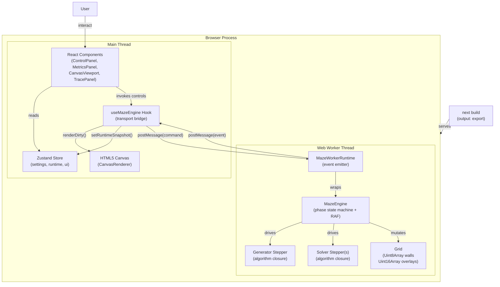
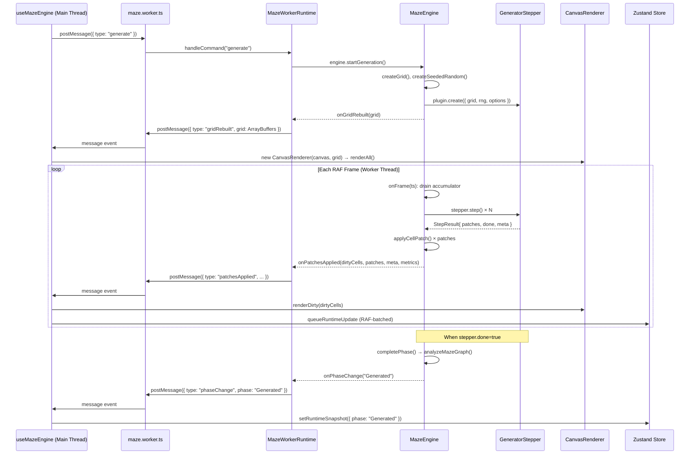
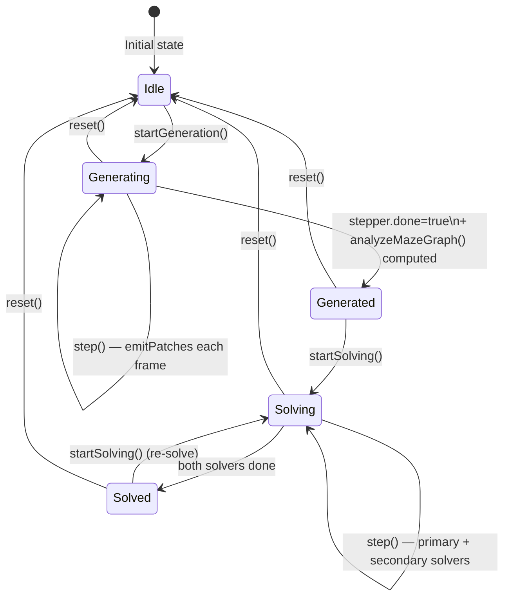

# Mazer Architecture

> **Definitive technical reference for the Mazer maze algorithm visualizer.**
> Covers every architectural layer, data model, execution loop, and design decision.
> All source references are precise: file paths and line numbers were verified against the actual codebase.

---

## Table of Contents

1. [Project Overview & Domain](#1-project-overview--domain)
2. [Tech Stack & Environment](#2-tech-stack--environment)
3. [Project Structure & Boundary Enforcement](#3-project-structure--boundary-enforcement)
4. [Architecture & Design Patterns](#4-architecture--design-patterns)
5. [Core Components & High-Performance Data Models](#5-core-components--high-performance-data-models)
6. [Algorithm Plugin Ecosystem](#6-algorithm-plugin-ecosystem)
7. [Data Flow & Execution Lifecycle](#7-data-flow--execution-lifecycle)
8. [State Management](#8-state-management)
9. [Configuration & Ecosystem Tuning](#9-configuration--ecosystem-tuning)
10. [Testing Strategy & CI Considerations](#10-testing-strategy--ci-considerations)
11. [Security & Edge Case Analysis](#11-security--edge-case-analysis)
12. [Performance & Scalability Analysis](#12-performance--scalability-analysis)
13. [Architectural Diagrams](#13-architectural-diagrams)
14. [Interesting & Non-Obvious Facts](#14-interesting--non-obvious-facts)
15. [Improvement Recommendations](#15-improvement-recommendations)

---

## 1. Project Overview & Domain

### What Is Mazer?

Mazer is a **deterministic maze generation and solving visualizer**. It renders the step-by-step internal state of classic and exotic graph algorithms directly onto an HTML5 Canvas, frame by frame, so users can watch the "thinking process" of algorithms like Prim's MST, Recursive Division, Wilson's loop-erased random walk, Wave Function Collapse, or A* pathfinding in real time.

The core educational proposition is **algorithm transparency**: rather than presenting a finished maze, Mazer exposes every intermediate state transition as a visual event. Each cell carving, frontier expansion, path relaxation, or solver backtrack is rendered at the exact frame it occurs.

### Domain Model

The problem domain is a **2D grid maze** modeled as a planar graph:

- **Cells** are nodes.
- **Walls** are the *absence* of edges between adjacent nodes.
- **Generation** = building a spanning tree (or loopy graph) by progressively removing walls.
- **Solving** = traversing the resulting graph from `index=0` (top-left) to `index=cellCount-1` (bottom-right).

Mazer supports three topological categories:

| Topology | Description | Example Algorithms |
|---|---|---|
| `perfect-planar` | Spanning tree — exactly one path between any two cells | DFS Backtracker, Prim, Wilson, Eller |
| `loopy-planar` | Contains cycles — multiple paths may exist | Braid, Percolation, Reaction Diffusion |
| `weave` | Cells can cross over/under each other via tunnels | Weave Growing Tree |

### Likely Users

- **Computer science students** studying graph algorithms and data structures.
- **Algorithm enthusiasts** exploring the visual aesthetics of maze-construction heuristics.
- **Educators** demonstrating BFS vs. DFS, MST algorithms, or heuristic search.
- **Developers** evaluating Mazer as a reference implementation of a plugin-based step visualization engine.

---

## 2. Tech Stack & Environment

### Frontend Stack

| Concern | Technology | Version |
|---|---|---|
| Framework | Next.js (App Router) | 15.x |
| UI Library | React | 19.x |
| Language | TypeScript (strict) | 5.7.x |
| State Management | Zustand | 5.x |
| Styling | CSS Modules + global CSS | — |
| Fonts | Google Fonts via Next.js font optimization | — |

### Rendering Layer

- **Raw HTML5 Canvas 2D API** — no WebGL, no third-party canvas library.
- **DPR-aware scaling**: the renderer computes a safe device pixel ratio that respects both native DPR and hard limits on canvas backing-store dimensions (`CANVAS_MAX_BACKING_DIMENSION = 16,384px`, `CANVAS_MAX_BACKING_PIXELS = 48,000,000`).
- **Dirty-cell redraw**: only cells that changed (plus their cardinal neighbors) are redrawn per frame.

### Build & Test Tools

| Tool | Purpose |
|---|---|
| Next.js (webpack/turbopack) | App bundle, static export |
| TypeScript `tsc --noEmit` | Full type checking |
| ESLint (`--max-warnings=0`) | Zero-warning lint gate |
| Vitest 3.x | Unit + integration tests (Node environment) |
| Vitest fake timers | RAF/setTimeout mocking in engine tests |

### Runtime Environments

- **Browser**: Primary runtime. `requestAnimationFrame` drives the visualization loop. The engine runs inside a Web Worker (preferred) or falls back to the main thread.
- **Node.js**: Used exclusively by Vitest for tests. The engine detects the absence of `requestAnimationFrame` and falls back to `setTimeout(..., 16)` at `MazeEngine.ts:779`.
- **Web Worker**: `maze.worker.ts` provides algorithmic isolation from the main thread. Transferable `ArrayBuffer` objects enable zero-copy grid snapshots over the worker boundary.

---

## 3. Project Structure & Boundary Enforcement

### Annotated Directory Tree

```
mazer/
├── app/                          # Next.js App Router entry points
│   ├── layout.tsx                # Root HTML shell, font config, metadata
│   ├── page.tsx                  # Single-page client component ("use client")
│   └── globals.css               # Global CSS resets, font variables
│
├── src/
│   ├── config/
│   │   └── limits.ts             # All numeric constants & clamping functions
│   │
│   ├── core/                     # ✦ Pure algorithmic logic — NO UI imports
│   │   ├── grid.ts               # Grid model, bitmask enums, TypedArrays
│   │   ├── patches.ts            # CellPatch & StepResult interfaces
│   │   ├── rng.ts                # Mulberry32 PRNG, FNV-1a string hash
│   │   ├── analysis/
│   │   │   └── graphMetrics.ts   # Degree analysis, BFS, shortest-path count
│   │   └── plugins/
│   │       ├── pluginMetadata.ts # PluginMetadata, PluginTier, MazeTopology
│   │       ├── GeneratorPlugin.ts# GeneratorPlugin<TOptions, TMeta> interface
│   │       ├── SolverPlugin.ts   # SolverPlugin<TOptions, TMeta> interface
│   │       ├── types.ts          # AlgorithmStepMeta, GeneratorRunOptions, etc.
│   │       ├── generators/       # 40 generator plugin implementations
│   │       │   └── index.ts      # Catalog: generatorPlugins[]
│   │       └── solvers/          # 34 solver plugin implementations
│   │           └── index.ts      # Catalog: solverPlugins[]
│   │
│   ├── engine/                   # ✦ Runtime orchestration — no React/DOM
│   │   ├── MazeEngine.ts         # Phase state machine, RAF loop, metrics
│   │   ├── types.ts              # MazePhase, MazeMetrics, MazeEngineOptions, etc.
│   │   ├── mazeWorkerProtocol.ts # Command/event union types, grid serialization
│   │   ├── mazeWorkerRuntime.ts  # MazeWorkerRuntime wrapping MazeEngine
│   │   └── maze.worker.ts        # Web Worker entry point bootstrap
│   │
│   ├── render/                   # ✦ Canvas drawing — no React state
│   │   ├── CanvasRenderer.ts     # DPR-aware renderer, dirty-cell logic
│   │   └── colorPresets.ts       # ColorTheme interface + 4 built-in themes
│   │
│   └── ui/                       # ✦ React + Zustand — no raw canvas access
│       ├── store/
│       │   └── mazeStore.ts      # Zustand store: settings, runtime, ui slices
│       ├── hooks/
│       │   └── useMazeEngine.ts  # Engine lifecycle, worker/fallback transport
│       ├── constants/
│       │   ├── algorithms.ts     # GENERATOR_OPTIONS & SOLVER_OPTIONS arrays
│       │   └── algorithmDocs.ts  # Pseudocode + descriptions per algorithm
│       └── components/
│           ├── CanvasViewport.tsx      # Canvas container, playback controls
│           ├── ControlPanel.tsx        # Algorithm/speed/grid/seed selectors
│           ├── MetricsPanel.tsx        # Live metrics, battle comparison cards
│           ├── GeneratorTracePanel.tsx # Pseudocode display with line highlight
│           └── MazeConfigPanel.tsx     # Advanced config (battle mode, params)
│
├── tests/
│   ├── core/
│   │   ├── generators.test.ts    # Determinism, connectivity, topology
│   │   ├── solvers.test.ts       # Correctness, path validity, pacing
│   │   ├── graphMetrics.test.ts  # Graph analysis accuracy
│   │   └── rng.test.ts           # PRNG determinism
│   ├── engine/
│   │   ├── mazeEngine.test.ts    # Phase transitions, RAF loop, callbacks
│   │   ├── mazeWorker.test.ts    # Worker IPC, grid serialization
│   │   └── mazeWorkerRuntime.test.ts # Runtime state, line tracking
│   └── config/
│       └── limits.test.ts        # Clamping function correctness
│
├── next.config.ts                # output: "export" (static HTML)
├── tsconfig.json                 # Strict mode, ES2022 target, @/ path alias
├── vitest.config.ts              # Test runner config
└── package.json                  # Dependencies manifest
```

### Boundary Enforcement

The four layers enforce strict one-way dependencies:

```
src/core/  ←────────── src/engine/  ←────────── src/render/
   ↑                        ↑                        ↑
   └────────────────── src/ui/ ──────────────────────┘
```

- `src/core/` has **zero imports** from engine, render, or ui layers. It contains only pure TypeScript with no DOM or React dependencies.
- `src/engine/` imports from `src/core/` only. It has no React, no DOM references beyond `requestAnimationFrame`/`performance.now` (both accessed via `globalThis` with fallbacks, see `MazeEngine.ts:775–789`).
- `src/render/` imports from `src/core/` and `src/config/`. It receives a `Grid` and an `HTMLCanvasElement` but has no knowledge of Zustand or React.
- `src/ui/` is the only layer allowed to import across all layers. The `useMazeEngine` hook bridges Zustand ↔ engine transport ↔ canvas renderer.

---

## 4. Architecture & Design Patterns

### 4.1 Overall Architectural Style

Mazer is a **step-based visualization engine** with a **patch-driven update model** organized in four clean layers. The macro architecture resembles an event-sourced system: rather than storing full grid snapshots at each step, the system emits atomic `CellPatch` deltas that are applied incrementally to a single shared grid.

### 4.2 Plugin System

Both generators and solvers follow the **Strategy + Factory** pattern, implementing the same narrow interface:

```typescript
// src/core/plugins/GeneratorPlugin.ts
interface GeneratorPlugin<TOptions, TMeta> extends PluginMetadata {
  id: string;
  label: string;
  create(params: GeneratorCreateParams<TOptions>): GeneratorStepper<TMeta>;
}

interface GeneratorStepper<TMeta> {
  step(): StepResult<TMeta>;
}
```

The `create()` call is the factory. It receives the grid, a seeded RNG, and plugin-specific options. It returns a `GeneratorStepper` — a closure or object whose single `step()` method advances the algorithm by exactly one logical step and returns the resulting `CellPatch` deltas. The plugin itself is stateless; all per-run state lives inside the stepper closure.

Solvers follow the identical pattern via `SolverPlugin` / `SolverStepper` (`src/core/plugins/SolverPlugin.ts`).

Plugins are registered in catalog arrays (`generatorPlugins`, `solverPlugins`) in their respective `index.ts` files. The engine indexes these at module load time into `Map<id, plugin>` structures (`MazeEngine.ts:58–61`) for O(1) lookup.

**Plugin Metadata** (`src/core/plugins/pluginMetadata.ts`) decorates each plugin with:

| Field | Type | Purpose |
|---|---|---|
| `topologyOut` | `"perfect-planar" \| "loopy-planar" \| "weave"` | Controls which solvers appear in the dropdown |
| `solverCompatibility` | `{ topologies, guarantee }` | Filtered by generator topology |
| `generatorParamsSchema` | `GeneratorParamSchema[]` | Drives dynamic UI controls |
| `tier` | `"research-core" \| "advanced" \| "alias"` | UI grouping and labeling |
| `implementationKind` | `"native" \| "alias" \| "hybrid"` | Documentation annotation |

### 4.3 State Machine (MazePhase)

`MazeEngine` implements a five-state machine. Transitions are always forward-only except for `reset` which collapses all states back to `Idle`.

```
         startGeneration()
Idle ──────────────────────► Generating
                                  │
                           done=true (completePhase)
                                  │
                                  ▼
                             Generated ◄───────────── startSolving() [re-solve]
                                  │
                          startSolving()
                                  │
                                  ▼
                              Solving
                                  │
                      both solvers done (completePhase)
                                  │
                                  ▼
                               Solved

Any state ──── reset() ────► Idle
```

Phase transitions emit `onPhaseChange` callbacks (`MazeEngine.ts:722–724`). The `completePhase()` method (`MazeEngine.ts:682–703`) handles the `Generating → Generated` transition by computing graph metrics synchronously and setting `paused = true`.

### 4.4 Publish-Subscribe / Reactive State

Three callback hooks connect the engine to the outside world (`src/engine/types.ts:77–86`):

```typescript
interface MazeEngineCallbacks {
  onPatchesApplied?(dirtyCells, patches, meta, metrics): void;
  onPhaseChange?(phase): void;
  onGridRebuilt?(grid): void;
}
```

`MazeWorkerRuntime` implements these callbacks and translates them into serialized `MazeWorkerEvent` messages emitted via `postMessage` (in worker mode) or direct function calls (in fallback mode). The `useMazeEngine` hook in React subscribes to these events and applies them to the canvas renderer and Zustand store.

### 4.5 Worker Command/Event Protocol

The worker protocol (`src/engine/mazeWorkerProtocol.ts`) defines two discriminated unions:

- **`MazeWorkerCommand`**: UI → Engine. Types: `init`, `setOptions`, `setSpeed`, `generate`, `solve`, `pause`, `resume`, `stepOnce`, `reset`, `rebuildGrid`, `dispose`.
- **`MazeWorkerEvent`**: Engine → UI. Types: `gridRebuilt`, `patchesApplied`, `runtimeSnapshot`, `phaseChange`, `error`.

Grid snapshots transferred over the worker boundary use `Transferable` objects: all four TypedArray `.buffer`s are passed in the transfer list, achieving **zero-copy IPC** (`mazeWorkerProtocol.ts:92–110`).

---

## 5. Core Components & High-Performance Data Models

### 5.1 `src/core/grid.ts` — The Bitmask Grid Model

The `Grid` interface (`grid.ts:53–61`) uses four TypedArrays for memory efficiency:

```typescript
interface Grid {
  width: number;
  height: number;
  cellCount: number;
  walls: Uint8Array;      // 1 byte per cell: 4-bit wall bitmask
  overlays: Uint16Array;  // 2 bytes per cell: 8-bit solver overlay flags
  crossings: Uint8Array;  // 1 byte per cell: CrossingKind enum
  tunnels: Int32Array;    // 4 bytes per cell: tunnel destination index (-1 = none)
}
```

**Memory footprint** for a 200×200 grid (40,000 cells):
- `walls`: 40 KB
- `overlays`: 80 KB
- `crossings`: 40 KB
- `tunnels`: 160 KB
- **Total**: ~320 KB

Compare this to a naive object-per-cell model: even a lean `{ walls: number, overlays: number }` object would cost ~80–100 bytes in V8, yielding 3.2–4 MB — **10× larger**, with poor cache locality.

#### WallFlag Bitmask (`grid.ts:3–8`)

```typescript
export const enum WallFlag {
  North = 1,   // 0001
  East  = 2,   // 0010
  South = 4,   // 0100
  West  = 8,   // 1000
}
export const ALL_WALLS = WallFlag.North | WallFlag.East | WallFlag.South | WallFlag.West; // 0b1111 = 15
```

Initialized to `ALL_WALLS = 15` (all four walls present). Carving a passage between two cells clears the appropriate bits on both sides:

```typescript
// grid.ts:187–203 — carvePatch factory
export function carvePatch(fromIndex, toIndex, wallFrom, wallTo): CellPatch[] {
  return [
    { index: fromIndex, wallClear: wallFrom },
    { index: toIndex,   wallClear: wallTo   },
  ];
}

// grid.ts:217–243 — applyCellPatch applies the delta
if (typeof patch.wallClear === "number") {
  grid.walls[i] &= ~patch.wallClear;  // bitwise AND with inverted mask
}
```

Wall presence check: `(grid.walls[i] & WallFlag.North) !== 0`.

#### OverlayFlag Bitmask (`grid.ts:13–22`)

The 8-bit overlay word packs **two solver channels** into a single `Uint16Array` element:

```typescript
export const enum OverlayFlag {
  Visited   = 1,    // 0000_0001 — Solver A visited
  Frontier  = 2,    // 0000_0010 — Solver A frontier
  Path      = 4,    // 0000_0100 — Solver A path
  Current   = 8,    // 0000_1000 — Solver A current cell
  VisitedB  = 16,   // 0001_0000 — Solver B visited
  FrontierB = 32,   // 0010_0000 — Solver B frontier
  PathB     = 64,   // 0100_0000 — Solver B path
  CurrentB  = 128,  // 1000_0000 — Solver B current cell
}
```

Bits 0–3 are the primary (Solver A) channel. Bits 4–7 are the secondary (Solver B / battle mode) channel. This design means both solver overlays coexist in memory without separate arrays or object merges.

Utility masks (`grid.ts:24–45`):
- `PRIMARY_OVERLAY_MASK = 0b0000_1111 = 15`
- `SECONDARY_OVERLAY_MASK = 0b1111_0000 = 240`
- `ANY_VISITED_OVERLAY_MASK = OverlayFlag.Visited | OverlayFlag.VisitedB = 17`

#### CrossingKind & Tunnels (`grid.ts:47–61`)

For weave mazes, cells can physically cross each other. `CrossingKind` (`grid.ts:47–51`) encodes which direction passes over:

```typescript
export const enum CrossingKind {
  None                    = 0,
  HorizontalOverVertical  = 1,
  VerticalOverHorizontal  = 2,
}
```

`tunnels` stores the flat index of the cell on the other side of a crossing. `traversableNeighbors()` (`grid.ts:177–185`) includes tunnel destinations alongside wall-carved neighbors, so solvers work on weave mazes without modification.

#### Indexing (`grid.ts:125–135`)

```typescript
// Row-major: idx = y * width + x
export function idx(grid, x, y): number {
  return y * grid.width + x;
}
export function xFromIdx(grid, index): number { return index % grid.width; }
export function yFromIdx(grid, index): number { return Math.floor(index / grid.width); }
```

### 5.2 `src/core/patches.ts` — The CellPatch Mechanism

The `CellPatch` interface (`patches.ts:1–9`) is the core delta unit:

```typescript
interface CellPatch {
  index: number;          // Target cell (flat index)
  wallSet?: number;       // OR these bits into walls[index]
  wallClear?: number;     // AND ~mask into walls[index]
  overlaySet?: number;    // OR these bits into overlays[index]
  overlayClear?: number;  // AND ~mask into overlays[index]
  crossingSet?: number;   // Assign crossings[index]
  tunnelToSet?: number;   // Assign tunnels[index]
}
```

All fields are optional. A typical generation step produces two patches (one per cell in the carved passage), each with only `wallClear` set. A solver step might produce patches with `overlaySet`/`overlayClear` for visited/frontier/path state.

**Why patches instead of full-grid snapshots?**

1. **Memory**: A single generation step affecting 2 cells produces 2 × ~40 bytes of patches vs. copying 40,000 bytes.
2. **Renderer efficiency**: The `dirtyCells` array derived from patches is the minimal redraw set. Only those cells (+ cardinal neighbors for wall overlap) are repainted.
3. **Worker IPC**: Patches are plain JSON-serializable objects. Transferring only deltas over `postMessage` is orders of magnitude cheaper than cloning the full grid buffer on each step.

`StepResult<TMeta>` (`patches.ts:13–17`) pairs a batch of patches with metadata:

```typescript
interface StepResult<TMeta extends StepMeta> {
  done: boolean;
  patches: CellPatch[];
  meta?: TMeta;  // StepMeta = Record<string, number | string | boolean | undefined>
}
```

The `meta` field carries algorithm-specific data: `visitedCount`, `frontierSize`, `pathLength`, `line` (pseudocode line number), and `solverRole` (`"A"` or `"B"` in battle mode).

### 5.3 `src/core/rng.ts` — Deterministic RNG

Mazer uses **Mulberry32** (`rng.ts:18–44`), a fast 32-bit PRNG with good statistical properties, seeded from a string:

```typescript
// FNV-1a-like hash: string → uint32
export function hashStringToSeed(input: string): number {
  let h = 2166136261 >>> 0;  // FNV offset basis (unsigned)
  for (let i = 0; i < input.length; i++) {
    h ^= input.charCodeAt(i);
    h = Math.imul(h, 16777619);  // FNV prime
  }
  return h >>> 0;
}

// Mulberry32 state update
state = (state + 0x6d2b79f5) >>> 0;
let t = state;
t = Math.imul(t ^ (t >>> 15), t | 1);
t ^= t + Math.imul(t ^ (t >>> 7), t | 61);
return ((t ^ (t >>> 14)) >>> 0) / 4294967296;
```

`createSeededRandom(seedText)` (`rng.ts:46–48`) wraps this in a `RandomSource` interface with `next()`, `nextInt(max)`, and `pick(items[])`. Every generator and solver receives this interface at creation time.

**Determinism guarantee**: The seed string `"mazer"` always produces the identical maze on the identical grid dimensions. Battle mode uses derived seeds: `${seed}-solve-a` and `${seed}-solve-b` (`MazeEngine.ts:183–194`), ensuring solver behavior is also reproducible.

### 5.4 `src/engine/MazeEngine.ts` — The RAF Execution Loop

`MazeEngine` implements `MazeEnginePublicApi` (`engine/types.ts:88–104`). Its most critical method is the RAF frame handler:

#### `onFrame(ts: number)` — `MazeEngine.ts:337–399`

```typescript
private onFrame(ts: number): void {
  this.rafHandle = null;

  if (!this.hasActiveWork()) return;

  // Initialize timestamp on first frame
  if (this.lastFrameTs === 0) this.lastFrameTs = ts;

  const delta = ts - this.lastFrameTs;
  this.lastFrameTs = ts;

  if (!this.paused) {
    this.metrics.elapsedMs += delta;

    const stepInterval = 1000 / this.options.speed;  // ms per step
    this.accumulatorMs += delta;

    const dirtySet = new Set<number>();
    const patches: CellPatch[] = [];
    let latestMeta: StepMeta | undefined;
    let stepped = false;
    let iteration = 0;

    // Drain the time accumulator: execute as many steps as fit in this frame
    while (
      this.accumulatorMs >= stepInterval &&
      iteration < ENGINE_MAX_STEPS_PER_FRAME &&  // Hard cap: 2000 steps/frame
      this.hasActiveWork()
    ) {
      const result = this.processStep();
      if (!result) break;

      stepped = true;
      latestMeta = result.meta;
      patches.push(...result.patches);
      for (const cell of result.dirtyCells) dirtySet.add(cell);  // deduplicate

      this.accumulatorMs -= stepInterval;
      iteration++;

      if (result.done) break;
    }

    if (stepped) {
      this.metrics.dirtyCellCount += dirtySet.size;
      this.recomputeDerivedMetrics();
      this.syncBattleMetricsSnapshot();
      this.emitPatches(Array.from(dirtySet), patches, latestMeta);  // single emit per frame
    }
  }

  if (this.hasActiveWork() && !this.paused) this.ensureLoop();
}
```

**Key design decisions:**

1. **Accumulator-based time budget**: `accumulatorMs` grows with each frame's delta. For a speed of 60 steps/sec, each step requires ~16.67ms. If a frame takes 32ms (skipped), 2 steps are executed. This makes visualization speed **wall-clock accurate** rather than frame-count-accurate.

2. **`ENGINE_MAX_STEPS_PER_FRAME = 2000`** (`limits.ts:14`): A hard cap preventing a single frame from consuming unbounded compute time. At 8,000 steps/sec, a 16ms frame would nominally queue 128 steps — well within the cap. The cap matters at high speeds on slow machines.

3. **One emit per frame**: All patches accumulated across multiple steps within a single frame are bundled into one `onPatchesApplied` call. The `dirtySet` (a `Set<number>`) deduplicates cell indices so the renderer gets the minimal unique set.

4. **RAF fallback for Node**: `MazeEngine.ts:774–789` checks `globalThis.requestAnimationFrame`. In Node.js (Vitest), this is absent and the engine falls back to `setTimeout(() => callback(nowMs()), 16)`, making the engine testable without a browser.

#### Battle Mode — `MazeEngine.ts:452–579`

In `Solving` phase with `battleMode: true`, both `solverPrimary` (role `"A"`) and `solverSecondary` (role `"B"`) step in the same frame. Solver B's patches are remapped before application:

```typescript
// MazeEngine.ts:792–826
function remapPatchForSecondary(patch: CellPatch): CellPatch {
  return {
    ...patch,
    overlaySet: mapPrimaryToSecondaryOverlay(patch.overlaySet),
    overlayClear: mapPrimaryToSecondaryOverlay(patch.overlayClear),
  };
}

function mapPrimaryToSecondaryOverlay(mask: number): number {
  let mapped = 0;
  if (mask & OverlayFlag.Visited)  mapped |= OverlayFlag.VisitedB;
  if (mask & OverlayFlag.Frontier) mapped |= OverlayFlag.FrontierB;
  if (mask & OverlayFlag.Path)     mapped |= OverlayFlag.PathB;
  if (mask & OverlayFlag.Current)  mapped |= OverlayFlag.CurrentB;
  return mapped;
}
```

This is a pure bitwise operation: each primary flag (bits 0–3) maps to the corresponding secondary flag (bits 4–7) — effectively a left shift of 4. Solver B's algorithm implementation is entirely unaware of this remapping.

#### Graph Metrics — Computed Once at Phase Boundary (`MazeEngine.ts:682–694`)

```typescript
private completePhase(): void {
  if (this.phase === "Generating") {
    this.generatorStepper = null;
    this.paused = true;
    this.metrics.graph = analyzeMazeGraph(
      this.grid,
      0,                         // startIndex = top-left
      this.grid.cellCount - 1,   // goalIndex  = bottom-right
    );
    this.phase = "Generated";
    this.emitPhase();
    return;
  }
  // ...
}
```

Graph metrics are computed **synchronously** when generation completes. This is acceptable because it happens at a phase boundary (not every frame) and the computation is O(N) in cell count. The snapshot is preserved through the entire solving phase and reset on the next `generate` call.

### 5.5 `src/render/CanvasRenderer.ts` — Dirty-Cell Rendering

#### DPR Computation (`CanvasRenderer.ts:87–98`)

```typescript
private computeSafeDpr(widthPx: number, heightPx: number): number {
  const rawDpr = globalThis.devicePixelRatio ?? 1;
  const maxByWidth  = CANVAS_MAX_BACKING_DIMENSION / Math.max(1, widthPx);
  const maxByHeight = CANVAS_MAX_BACKING_DIMENSION / Math.max(1, heightPx);
  const maxByPixels = Math.sqrt(CANVAS_MAX_BACKING_PIXELS / Math.max(1, widthPx * heightPx));
  return Math.max(0.1, Math.min(rawDpr, maxByWidth, maxByHeight, maxByPixels));
}
```

The effective DPR is clamped by three constraints: max backing dimension (16,384px per axis), max total pixels (48,000,000), and native device DPR. On a 2× HiDPI display with a 1600px-wide grid, the DPR might be clamped below 2 to avoid exceeding canvas memory limits.

#### Dirty Expansion (`CanvasRenderer.ts:371–397`)

```typescript
private expandDirty(cells: number[]): number[] {
  const output = new Set<number>();
  for (const index of cells) {
    output.add(index);
    const x = index % this.grid.width;
    const y = Math.floor(index / this.grid.width);
    if (x > 0)                        output.add(index - 1);          // West neighbor
    if (x + 1 < this.grid.width)      output.add(index + 1);          // East neighbor
    if (y > 0)                         output.add(index - this.grid.width); // North neighbor
    if (y + 1 < this.grid.height)      output.add(index + this.grid.width); // South neighbor
  }
  return Array.from(output);
}
```

Walls are drawn as filled rectangles that extend outward from the cell boundary (`drawWalls`, `CanvasRenderer.ts:260–304`). Because a North wall of cell `i` visually overlaps cell `i - width` (the cell above), redrawing only cell `i` leaves a visual artifact in the neighboring cell. Expanding the dirty set to cardinal neighbors prevents this at the cost of ~5× more `drawCell` calls, which is still far cheaper than a full grid redraw.

#### Wall Rendering Design (`CanvasRenderer.ts:260–304`)

```typescript
// Walls use filled rectangles, not stroked lines.
// Key reason: eliminates corner gaps where perpendicular walls meet.
this.ctx.fillStyle = this.colors.wall;
if ((walls & WallFlag.North) !== 0) {
  this.ctx.fillRect(x, y - hw, size, wallWidth);       // extends above cell top
}
if ((walls & WallFlag.South) !== 0) {
  this.ctx.fillRect(x, y + size - hw, size, wallWidth); // straddles cell bottom
}
if ((walls & WallFlag.West) !== 0) {
  this.ctx.fillRect(x - hw, y, wallWidth, size);        // straddles cell left
}
if ((walls & WallFlag.East) !== 0) {
  this.ctx.fillRect(x + size - hw, y, wallWidth, size); // extends right
}
```

`hw = wallWidth / 2`. Walls straddle the cell boundary, centering the wall rectangle on the edge. This means adjacent cells share the same physical wall pixels — there are no sub-pixel gaps.

---

## 6. Algorithm Plugin Ecosystem

### 6.1 Generator Catalog (40 algorithms)

Generators are grouped by tier and topology:

**Research Core — Perfect Planar (spanning tree):**
DFS Backtracker, BFS Tree, Binary Tree, Sidewinder, Aldous-Broder, Wilson, Eller, Recursive Division, Hunt and Kill, Prim (True / Simplified / Modified / Frontier Edges), Kruskal, Boruvka, Houston, BSP, Origin Shift, Unicursal, Reverse Delete, Growing Tree, Growing Forest, Vortex, Blobby Recursive Subdivision, Fractal Tessellation

**Research Core — Loopy Planar (cycles present):**
Braid, Prim Loopy, Kruskal Loopy, Recursive Division Loopy

**Advanced / Experimental:**
Weave Growing Tree (`weave` topology), Cellular Automata, Maze-CA, Mazectric-CA, Erosion, Wave Function Collapse (`loopy-planar`), Percolation (`loopy-planar`), L-System, Reaction Diffusion (`loopy-planar`), Ising Model, DLA, Hilbert Curve, Voronoi, Ant Colony (generator), Quantum Seismogenesis, Mycelial Anastomosis, Sandpile Avalanche, Resonant Phase Lock, Counterfactual Cycle Annealing

### 6.2 Solver Catalog (34 algorithms)

**Guaranteed — All Topologies:**
BFS, DFS, IDDFS, IDA*, Dijkstra, A* (Manhattan heuristic), A* (Euclidean), Bidirectional BFS, Lee Wavefront, Flood Fill, Chain, Fringe Search, Shortest Path Finder, Shortest Paths Finder

**Guaranteed — Perfect Planar Only:**
Dead-End Filling, Cul-de-Sac Filler, Blind Alley Filler, Blind Alley Sealer, Tremaux, Collision

**Wall-Following (Perfect Planar only):**
Left Wall Follower, Right Wall Follower (`wall-follower`), Pledge

**Heuristic / Probabilistic:**
Greedy Best-First, Weighted A*, Q-Learning, Ant Colony (solver), Genetic, RRT*, Physarum, Electric Circuit, Potential Field, Frontier Explorer

**Incomplete:**
Random Mouse

### 6.3 How Algorithmic State Persists Between Steps

Every plugin's `create()` factory returns a **closure-based stepper**. The algorithm's internal state (stacks, queues, frontier sets, visited bitsets) lives inside the closure's lexical scope. Each `step()` call advances the algorithm by exactly one logical unit (e.g., one cell visit, one edge relaxation, one frontier expansion) and yields the resulting patches.

Example (DFS Backtracker conceptual structure):

```typescript
// generators/dfsBacktracker.ts — conceptual structure
function create({ grid, rng }): GeneratorStepper {
  const stack: number[] = [0];
  const visited = new Uint8Array(grid.cellCount);  // typed for efficiency
  visited[0] = 1;

  return {
    step(): StepResult {
      if (stack.length === 0) return { done: true, patches: [] };

      const current = stack[stack.length - 1] as number;
      const unvisited = neighbors(grid, current).filter(n => !visited[n.index]);

      if (unvisited.length === 0) {
        stack.pop();
        return { done: stack.length === 0, patches: [], meta: { line: 5, visitedCount: ... } };
      }

      const next = rng.pick(unvisited);
      visited[next.index] = 1;
      stack.push(next.index);

      const patches = carvePatch(current, next.index, next.direction.wall, next.direction.opposite);
      // + overlay patches for Current, Visited, Frontier markers

      return { done: false, patches, meta: { line: 3, visitedCount: ..., frontierSize: stack.length } };
    }
  };
}
```

This design means:
- **No main-thread blocking**: Each `step()` returns in microseconds. The RAF loop controls how many steps execute per frame.
- **No full-grid iteration inside `step()`**: Algorithms operate on the frontier/stack only.
- **Implicit state serialization**: The closure variables serve as the full checkpoint. Pause/resume is free — just stop calling `step()`.

### 6.4 Dynamic UI Parameters via `generatorParamsSchema`

Some generators expose tunable parameters through `PluginMetadata.generatorParamsSchema` (`pluginMetadata.ts:9–43`). The schema supports three field types:

```typescript
type GeneratorParamSchema =
  | { type: "number"; key; label; min; max; step?; defaultValue }
  | { type: "boolean"; key; label; defaultValue }
  | { type: "select"; key; label; options: {label, value}[]; defaultValue }
```

The `MazeConfigPanel` component reads this schema at runtime and renders the appropriate input controls. Parameters are passed into `plugin.create({ options: generatorParams })`. This avoids hardcoding algorithm-specific UI and allows new algorithms to expose controls without modifying React components.

---

## 7. Data Flow & Execution Lifecycle

### 7.1 Step-by-Step "Generate" Walkthrough

```
1. User changes settings in ControlPanel
   └─ Zustand: setSeed(), setGeneratorId(), setGridWidth(), etc.

2. User clicks "Generate"
   └─ controls.generate() in useMazeEngine.ts:376–386
      ├─ syncEngineOptions() → dispatches setOptions command
      └─ dispatches "generate" command to worker/fallback transport

3. Worker receives "generate" command
   └─ MazeWorkerRuntime.handleCommand("generate")
      └─ engine.startGeneration() — MazeEngine.ts:140–166
         ├─ createGrid(width, height) — allocates TypedArrays, fills walls=ALL_WALLS
         ├─ emits onGridRebuilt → serialized grid snapshot → postMessage to UI
         ├─ createSeededRandom(seed) — deterministic RNG
         ├─ plugin.create({ grid, rng, options: generatorParams })
         ├─ phase = "Generating", emitPhase()
         ├─ paused = false, accumulatorMs = 0
         └─ ensureLoop() → schedules RAF

4. UI receives "gridRebuilt" event
   └─ useMazeEngine handleEvent:
      ├─ deserializeGridSnapshot(event.grid) → local Grid copy
      └─ new CanvasRenderer(canvas, grid, settings) → full renderAll()

5. RAF fires (inside Worker or in fallback: main thread with setTimeout)
   └─ MazeEngine.onFrame(ts):
      ├─ delta = ts - lastFrameTs
      ├─ accumulatorMs += delta
      ├─ LOOP while (accumulatorMs >= stepInterval && iteration < 2000):
      │   ├─ stepper.step() → StepResult{ patches, done, meta }
      │   ├─ applyCellPatch(grid, patch) for each patch
      │   ├─ dirtyCells.add(patch.index)
      │   └─ accumulatorMs -= stepInterval
      └─ emitPatches(dirtyCells, patches, meta, metrics) → postMessage

6. UI receives "patchesApplied" event
   └─ useMazeEngine handleEvent:
      ├─ applyCellPatch(localGrid, patch) for each patch (keeps local copy in sync)
      └─ renderer.renderDirty(dirtyCells) → expandDirty → drawCell for each

7. UI receives "runtimeSnapshot" event (piggybacked after each patchesApplied)
   └─ queueRuntimeUpdate(runtime) → RAF-batched → setRuntimeSnapshot in Zustand
      └─ React re-renders: MetricsPanel, GeneratorTracePanel update

8. When stepper.done === true:
   └─ MazeEngine.completePhase():
      ├─ analyzeMazeGraph(grid, 0, cellCount-1) → metrics.graph snapshot
      ├─ phase = "Generated"
      └─ emitPhase() → paused = true, RAF stops
```

### 7.2 Asynchronous Decoupling

There are two distinct async boundaries:

**Boundary 1: Worker ↔ Main Thread**
- Commands flow Main → Worker via `postMessage`.
- Events flow Worker → Main via `postMessage`.
- Grid snapshots use Transferable ArrayBuffers (zero-copy).
- Patches and runtime snapshots are plain JSON (structured clone).

**Boundary 2: Engine Loop ↔ React Rendering**
- The engine emits `onPatchesApplied` potentially many times per second.
- `useMazeEngine` receives these events and immediately calls `renderer.renderDirty()` (imperative, bypasses React).
- Runtime state updates (metrics, phase, active lines) are batched via `queueRuntimeUpdate` (`useMazeEngine.ts:114–132`): multiple updates within one animation frame are merged into a single `setRuntimeSnapshot` Zustand call. This prevents React from re-rendering once per algorithm step.

### 7.3 Graph Metrics Computation (`src/core/analysis/graphMetrics.ts`)

`analyzeMazeGraph` (`graphMetrics.ts:19–57`) runs once at generation completion:

1. **Degree analysis** (O(N)): For each cell, count traversable neighbors (walls cleared + tunnels). Accumulate `degreeSum`, count `deadEndCount` (degree ≤ 1) and `junctionCount` (degree ≥ 3).

2. **Edge count**: `edgeCount = degreeSum / 2` (each edge counted twice by degree sum).

3. **Cycle count** via Euler characteristic: `cycleCount = max(0, edgeCount - cellCount + componentCount)`. This is the cycle rank (first Betti number) of the graph. For a spanning tree, `edgeCount = cellCount - 1` and `componentCount = 1`, giving `cycleCount = 0`.

4. **Component count** (`countComponents`): BFS flood-fill in O(N). Perfect mazes always return 1.

5. **Shortest path count** (`countShortestPaths`): Two-pass BFS:
   - Pass 1: Standard BFS to compute `distances[]` from start.
   - Pass 2: Forward propagation of path counts along BFS level fronts, capped at `1,000,000` to prevent overflow on highly connected grids.

---

## 8. State Management

### 8.1 Two-Tier State Architecture

Mazer cleanly separates high-frequency internal state from low-frequency UI state:

| Tier | Location | Update Rate | Technology |
|---|---|---|---|
| High-Frequency | `MazeEngine` private fields (`grid`, `metrics`, `accumulatorMs`) | Every algorithm step (up to 8,000/sec) | Mutable class fields, TypedArrays |
| Mid-Frequency | `MazeWorkerRuntime` active line tracking | Every step | Plain object, updated in-place |
| Low-Frequency | Zustand `MazeRuntime` slice | Once per RAF via `queueRuntimeUpdate` | Immutable Zustand updates |
| Configuration | Zustand `MazeSettings` slice | On user interaction | Immutable Zustand updates |
| UI State | Zustand `MazeUI` slice | On user interaction | Immutable Zustand updates |

### 8.2 Zustand Store Shape (`src/ui/store/mazeStore.ts`)

Three slices:

**`MazeSettings`** (`mazeStore.ts:15–35`): All user-configurable options. Mutations via typed setters that clamp values using `src/config/limits.ts` functions (e.g., `setGridWidth` calls `clampGridWidth(value, height, cellSize)` to enforce multi-axis constraints).

Default values (`mazeStore.ts:106–126`):
- Generator: `dfs-backtracker`
- Solver: `bfs` (A vs. `astar` in battle mode)
- Speed: 60 steps/sec
- Grid: 40×25 cells at 16px/cell
- Seed: `"mazer"`

**`MazeRuntime`** (`mazeStore.ts:44–51`): Reflects the engine's observable state. `phase`, `paused`, `metrics` (full `MazeMetrics` object), and active pseudocode lines for generator and both solvers.

**`MazeUI`** (`mazeStore.ts:37–42`): Sidebar collapse, HUD visibility toggles, metrics expansion state.

### 8.3 Safe Connection: React ↔ Non-React Engine

The `useMazeEngine` hook (`src/ui/hooks/useMazeEngine.ts`) uses three patterns to safely bridge React lifecycle with the imperative engine:

1. **Ref-based engine handles** (`transportRef`, `rendererRef`, `gridRef`): These hold non-React objects. Changes to them do not trigger re-renders.

2. **Settings ref** (`settingsRef`): `settingsRef.current = settings` keeps a synchronous reference to the latest Zustand settings inside stale callbacks, avoiding stale closure issues without adding settings to dependency arrays.

3. **RAF-batched runtime updates** (`queueRuntimeUpdate`): A `requestAnimationFrame` coalesces multiple rapid runtime updates into one Zustand `setRuntimeSnapshot` call. This means React re-renders for metrics are frame-rate-limited (~60/sec) regardless of algorithm step rate (up to 8,000/sec).

---

## 9. Configuration & Ecosystem Tuning

### 9.1 `src/config/limits.ts` — All Tunable Constants

```typescript
SPEED_MIN = 1          // steps/sec — minimum visualization speed
SPEED_MAX = 8_000      // steps/sec — maximum before frame-cap kicks in

GRID_MIN = 2           // cells per axis (both dimensions)
GRID_MAX = 200         // cells per axis
GRID_MAX_CELLS = 40_000 // total cell cap (e.g., 200×200 = exactly 40,000)

CELL_MIN = 2           // px per cell
CELL_MAX = 40          // px per cell

VIEWPORT_MAX_DIMENSION_PX = 16_384   // CSS pixel limit per axis
VIEWPORT_MAX_PIXELS = 25_000_000     // Total viewport CSS pixel area

ENGINE_MAX_STEPS_PER_FRAME = 2_000   // Hard cap for RAF batch
CANVAS_MAX_BACKING_DIMENSION = 16_384 // Canvas backing-store pixel limit
CANVAS_MAX_BACKING_PIXELS = 48_000_000 // Total canvas memory limit
```

Multi-axis clamping functions ensure constraints are mutually consistent:
- `clampGridWidth(width, height, cellSize)` applies three constraints simultaneously: cell count, viewport dimension, viewport pixels.
- `clampGridSizeByCells(width, height)` enforces only `GRID_MAX_CELLS` (used by MazeEngine which has no cellSize context).

### 9.2 Environment Variables

There are **no `.env` files** in the project. All configuration is static TypeScript constants. The only environment-sensitive behavior is:
- Worker availability check: `typeof Worker === "undefined"` triggers the in-thread fallback.
- RAF availability check in `MazeEngine`: `typeof globalThis.requestAnimationFrame === "function"`.
- DPR check: `globalThis.devicePixelRatio ?? 1`.

### 9.3 Next.js Configuration (`next.config.ts`)

```typescript
const nextConfig: NextConfig = {
  reactStrictMode: true,
  output: "export",        // Static HTML export — no Node.js server required
};
```

`output: "export"` means the app builds to a static `out/` directory. This constrains the app to client-side rendering (no server components with data fetching). The `"use client"` directive on `app/page.tsx` is consistent with this choice.

### 9.4 Algorithm Documentation (`src/ui/constants/algorithmDocs.ts`)

Each algorithm has an entry with:
- `description`: One-line summary.
- `pseudocode`: Array of numbered steps (strings), displayed in `GeneratorTracePanel`.
- `inventor`: Optional attribution string.

The `pseudocode` array is 1-indexed by convention (line numbers in `meta.line` start at 1). `GeneratorTracePanel` highlights the element at `activeLine - 1` (0-based array index).

---

## 10. Testing Strategy & CI Considerations

### 10.1 Test Structure

Tests live in `tests/` and mirror the `src/` layer hierarchy:

| File | Scope | Key Assertions |
|---|---|---|
| `core/generators.test.ts` | All 40 generators | Determinism, full connectivity, topology invariants |
| `core/solvers.test.ts` | All 34 solvers | Path validity, goal reachability, visualization pacing |
| `core/graphMetrics.test.ts` | `analyzeMazeGraph` | Euler characteristic, dead-end count, shortest path count |
| `core/rng.test.ts` | Mulberry32 + hash | Same seed → same sequence; distribution |
| `engine/mazeEngine.test.ts` | `MazeEngine` | Phase transitions, RAF batching, callback contract |
| `engine/mazeWorker.test.ts` | Worker protocol | Grid serialization/deserialization, command handling |
| `engine/mazeWorkerRuntime.test.ts` | `MazeWorkerRuntime` | Event emission, active line tracking |
| `config/limits.test.ts` | All clamp functions | Boundary values, NaN/Infinity inputs |

### 10.2 Generator Determinism Testing

The standard pattern:

```typescript
function runGenerator(plugin, seed, width, height, maxSteps = 100_000) {
  const grid = createGrid(width, height);
  const rng = createSeededRandom(seed);
  const stepper = plugin.create({ grid, rng, options: {} });

  for (let i = 0; i < maxSteps; i++) {
    const result = stepper.step();
    for (const patch of result.patches) applyCellPatch(grid, patch);
    if (result.done) break;
  }
  return grid;
}

// Determinism: same seed → same wall array
const g1 = runGenerator(plugin, "test", 10, 10);
const g2 = runGenerator(plugin, "test", 10, 10);
expect(g1.walls).toEqual(g2.walls);

// Connectivity: BFS reaches all cells from corner 0
expect(isFullyConnected(g1)).toBe(true);

// Topology: no cycles for perfect-planar generators
if (plugin.topologyOut === "perfect-planar") {
  expect(analyzeMazeGraph(g1, 0, 99).cycleCount).toBe(0);
}
```

### 10.3 RAF Mocking in Engine Tests

```typescript
vi.useFakeTimers();

const engine = new MazeEngine(options, callbacks);
engine.startGeneration();

let i = 0;
while (engine.getPhase() === "Generating" && i < 500) {
  vi.advanceTimersByTime(100);  // Simulates 100ms real time per "frame"
  i++;
}

expect(engine.getPhase()).toBe("Generated");
```

In test environment, `MazeEngine.requestAnimationFrame` falls back to `setTimeout(..., 16)`. `vi.advanceTimersByTime(100)` fires multiple `setTimeout` callbacks, simulating multiple RAF frames. The accumulator arithmetic works identically in test and production.

### 10.4 Worker Runtime Mocking

`MazeWorkerRuntime` is tested with a mock emit function:

```typescript
const emitted: MazeWorkerEvent[] = [];
const runtime = new MazeWorkerRuntime((event) => emitted.push(event));

runtime.handleCommand({ type: "init", options });
runtime.handleCommand({ type: "generate" });

// Advance fake timers to complete generation
vi.advanceTimersByTime(5000);

const phaseChanges = emitted.filter(e => e.type === "phaseChange");
expect(phaseChanges.some(e => e.phase === "Generated")).toBe(true);
```

### 10.5 CI Gate

Pre-PR quality gate (also enforced in CI):

```bash
npm run lint      # ESLint --max-warnings=0 (hard fail on any warning)
npm run typecheck # tsc --noEmit (strict)
npm test          # Vitest (all suites must pass)
npm run build     # Next.js static export (build errors surface here)
```

---

## 11. Security & Edge Case Analysis

### 11.1 Input Validation

All user-facing numeric inputs are validated through `src/config/limits.ts` clamping functions before reaching the engine:

- `clampGridWidth`, `clampGridHeight`: multi-axis constraints prevent a grid that would exceed 40,000 cells or 16,384px CSS width.
- `clampCellSize`: ensures `CELL_MIN ≤ cellSize ≤ CELL_MAX` while also respecting viewport pixel budget.
- `clampSpeed`: clamps to `[1, 8000]`. NaN and Infinity are handled explicitly (`limits.ts:27–33`).
- The engine applies `clampGridSizeByCells` again at construction and in `setOptions`/`rebuildGrid` (`MazeEngine.ts:100–106`), providing a defense-in-depth second clamping layer even when called directly (e.g., from tests).

The seed string is passed directly to `hashStringToSeed` which processes it byte-by-byte. Since the hash output is always `>>> 0` (unsigned 32-bit), arbitrary strings including empty strings, Unicode, or XSS payloads simply produce a seed number without any risk of injection (the seed is never rendered back to DOM).

### 11.2 Thread-Blocking Risk

**Can an algorithm infinite-loop and crash the browser?**

The engine has two protections:

1. **`ENGINE_MAX_STEPS_PER_FRAME = 2000`** (`limits.ts:14`): Each RAF call processes at most 2,000 steps. Even if a step completes instantly, the engine yields back to the event loop after 2,000 iterations.

2. **`hasActiveWork()` guard** (`MazeEngine.ts:726–739`): The RAF loop only continues if a stepper exists and the phase is active. If a generator enters a degenerate state and never emits `done: true`, the engine will continue running but will never block indefinitely — it yields every frame.

**Residual risk**: A generator that runs for an astronomically large number of steps (e.g., Aldous-Broder on a large grid with an unlucky random walk) can take many wall-clock seconds at low speeds but will never freeze the browser tab because the RAF loop always yields.

**Not implemented**: There is no step-count timeout or watchdog timer. An algorithm that gets stuck in a finite loop producing patches but never setting `done: true` would run forever. This is acceptable for the current algorithm set, all of which have proven termination conditions.

### 11.3 Canvas Memory Safety

The DPR computation in `CanvasRenderer.computeSafeDpr` prevents canvas backing-store allocation errors. Without this, `canvas.width = 16384 * 3` on a 3× HiDPI display would attempt to allocate a ~2.4 GB backing store and throw an error or be silently clamped by the browser. The safe DPR is computed before `canvas.width` assignment.

---

## 12. Performance & Scalability Analysis

### 12.1 Memory Footprint

For a maximum-size 200×200 grid (40,000 cells):

| Structure | Type | Size |
|---|---|---|
| `walls` | `Uint8Array(40000)` | 40 KB |
| `overlays` | `Uint16Array(40000)` | 80 KB |
| `crossings` | `Uint8Array(40000)` | 40 KB |
| `tunnels` | `Int32Array(40000)` | 160 KB |
| Graph analysis `distances` | `Int32Array(40000)` | 160 KB (temporary) |
| Graph analysis `counts` | `Float64Array(40000)` | 320 KB (temporary) |
| **Grid total** | | **~320 KB persistent** |

The two copies of the grid (one in the worker, one in the UI thread as `gridRef`) add up to ~640 KB at maximum grid size. This is well within V8's typical heap budget.

### 12.2 Canvas Draw Call Analysis

For a full `renderAll()` on a 200×200 grid with all features enabled, `drawCell` is called 40,000 times. Each `drawCell` issues approximately:
- 2–3 `fillRect` calls (base cell + inset + overlays)
- 4 `fillRect` calls for walls (if all 4 walls present)
- 2 more calls for wall shadows

At 40,000 cells × ~9 calls = ~360,000 Canvas 2D API calls for a full repaint. This happens only on `renderAll()` (triggered by grid rebuild or settings change). During animation, `renderDirty()` typically touches 2–20 cells per frame at moderate speeds, resulting in ~20–200 draw calls per frame — negligible.

**Shadow blur is gated on cell size** (`CanvasRenderer.ts:168–175`):
```typescript
if (size >= 12) {
  this.ctx.shadowColor = this.colors.pathA;
  this.ctx.shadowBlur = size * 0.3;
}
```
Shadow blur is one of the most expensive Canvas 2D operations (forces software rendering in many browsers). Gating it on `size >= 12` means very large grids (small cell size) avoid this cost entirely.

### 12.3 Step Rate Scalability

At `SPEED_MAX = 8000` steps/sec with `ENGINE_MAX_STEPS_PER_FRAME = 2000`:
- At 60 fps, the engine processes at most `min(8000/60 ≈ 133, 2000) = 133` steps per frame.
- The cap of 2000 only matters at high speeds on machines running below ~4 fps (16ms/step would require 2000 steps to drain the accumulator).
- At 8000 steps/sec on a 40,000-cell grid, generation takes ~5 seconds (40,000 steps / 8,000 steps/sec).

### 12.4 Web Worker Offloading

**Status**: The Web Worker infrastructure is **fully implemented**. `maze.worker.ts` runs `MazeWorkerRuntime` in a dedicated worker thread. The `useMazeEngine` hook attempts Worker creation first and only falls back to the in-thread `MazeWorkerRuntime` if `Worker` is unavailable (e.g., test environment, certain server-side render contexts).

This means **all heavy computation** (stepper execution, patch application, graph metrics) runs on a background thread in production. The main thread only:
1. Receives serialized events via `onmessage`.
2. Applies patches to its local grid copy (`applyCellPatch` loop).
3. Calls `renderer.renderDirty()` (Canvas 2D draws).

The main thread is thus protected from algorithm compute spikes. A 200×200 Aldous-Broder generation running at 8,000 steps/sec will not drop animation frames on the UI side.

**Note on Transferable grids**: Grid snapshots (`gridRebuilt` events) transfer the four TypedArray `.buffer`s using the `transfer` list. The sender's buffers become detached after transfer — zero-copy, no serialization overhead. Patch arrays (`patchesApplied` events) use structured clone since they are plain JSON arrays.

### 12.5 Potential Bottlenecks at Scale

1. **Full `renderAll()` on settings change**: Changing `cellSize` triggers `setSettings → resize → renderAll()`. On a 200×200 grid at 40px/cell, this is 40,000 cell draws. Mitigation: the user must explicitly change settings; this is not on the hot path.

2. **Patch array growth in high-step-rate frames**: At 2000 steps/frame with algorithms that emit many patches (e.g., Bellman-Ford pass-by-pass emitting a full-grid snapshot per pass), the `patches` array in `onFrame` could grow large. The array is not pre-allocated but V8's array growth strategy handles this gracefully for typical counts.

3. **`expandDirty` Set creation**: Every `renderDirty` call creates a new `Set<number>`. At high step rates this is a GC pressure point. Mitigation: the dirty set is small (typically O(patches count × 5)), and the allocation is short-lived.

4. **No OffscreenCanvas**: The renderer uses the main-thread `HTMLCanvasElement`. Moving to `OffscreenCanvas` (transferring it to the worker) would allow Canvas draw calls to also happen off the main thread, preventing UI jank during large full-redraws. This is **not yet implemented**.

---

## 13. Architectural Diagrams

### 13.1 System Context Diagram



### 13.2 Execution Loop Component Diagram



### 13.3 Bitmask & Grid Data Model

```mermaid
graph LR
    subgraph GridArrays["Grid TypedArrays (per-cell, flat index)"]
        W["walls: Uint8Array<br/>bit3=West bit2=South<br/>bit1=East bit0=North<br/>Example: 0b0110 = East+South walls"]
        O["overlays: Uint16Array<br/>bit7=CurrentB bit6=PathB<br/>bit5=FrontierB bit4=VisitedB<br/>bit3=Current bit2=Path<br/>bit1=Frontier bit0=Visited"]
        C["crossings: Uint8Array<br/>0=None<br/>1=H-over-V<br/>2=V-over-H"]
        T["tunnels: Int32Array<br/>-1=no tunnel<br/>≥0=destination cell index"]
    end

    subgraph Patch["CellPatch Delta"]
        PI["index: number"]
        WS["wallSet?: number — OR into walls"]
        WC["wallClear?: number — AND ~mask into walls"]
        OS["overlaySet?: number — OR into overlays"]
        OC["overlayClear?: number — AND ~mask into overlays"]
        CS["crossingSet?: number — assign crossings"]
        TS["tunnelToSet?: number — assign tunnels"]
    end

    subgraph Apply["applyCellPatch (grid.ts:217)"]
        A1["walls[i] |= wallSet"]
        A2["walls[i] &= ~wallClear"]
        A3["overlays[i] |= overlaySet"]
        A4["overlays[i] &= ~overlayClear"]
    end

    Patch --> Apply
    Apply --> GridArrays
```



### 13.4 Phase State Machine



---

## 14. Interesting & Non-Obvious Facts

### 14.1 `const enum` for Zero-Cost Bitmasks

`WallFlag` and `OverlayFlag` are declared as `const enum` (`grid.ts:3`, `grid.ts:13`). In TypeScript with `const enum`, all usages are **inlined at compile time** — there is no runtime object. The expression `WallFlag.North | WallFlag.East` compiles to the literal `3`. This eliminates both the property lookup cost and the object allocation.

### 14.2 Battle Mode Overlay Remap Is a Bit Shift

The `mapPrimaryToSecondaryOverlay` function (`MazeEngine.ts:806–826`) performs a logical left shift of 4: `Visited(1) → VisitedB(16)`, `Frontier(2) → FrontierB(32)`, `Path(4) → PathB(64)`, `Current(8) → CurrentB(128)`. This could be written as `mask << 4` but the explicit flag-by-flag version is used for clarity and to guard against accidental shifting of non-overlay bits. The net effect is identical to `mask << 4` for valid primary overlay masks.

### 14.3 Bellman-Ford Visualization Pacing

Bellman-Ford (`solvers/bellmanFord.ts`) performs relaxation in passes over all edges. If visualized step-by-step, the solver would converge almost instantly on a connected maze — every pass would show many edge relaxations. The implementation groups an **entire pass into a single step**, emitting the full set of updated distance patches at once. This makes the visualization show pass-by-pass progress, giving the user a meaningful sense of iteration count.

### 14.4 Wall Rendering Eliminates Corner Gaps

Naive wall rendering using `strokeRect` leaves sub-pixel gaps at corners where two perpendicular walls meet. Mazer instead uses `fillRect` with walls that **straddle the cell boundary** (offset by `hw = wallWidth/2`). This means the North wall of cell `(i)` overlaps the South boundary of cell `(i - width)` — which is why `expandDirty` must add cardinal neighbors to prevent stale visual artifacts.

### 14.5 Solver Seeds Are Derived, Not User-Configurable

Solver seeds are derived as `${seed}-solve-a` and `${seed}-solve-b` (`MazeEngine.ts:183–194`). This means the same user seed always produces the same solver behavior, making battle comparisons reproducible. The user has no direct control over solver RNG but can influence it by changing the global seed.

### 14.6 `skipFirstGridSyncRef` Prevents Spurious Rebuild

`useMazeEngine` has a `skipFirstGridSyncRef` flag (`useMazeEngine.ts:106`). Without it, the `useEffect` watching `settings.gridWidth/gridHeight` would fire on mount (since these change from undefined to their initial values in React's first render), triggering a spurious `rebuildGrid` command that races with the `init` command. The skip flag suppresses the first fire of this effect, ensuring only subsequent user-driven width/height changes cause a rebuild.

### 14.7 `Math.imul` for 32-Bit Integer Multiplication

Both `hashStringToSeed` and `createMulberry32` use `Math.imul(a, b)` (`rng.ts:13, 26, 28`). JavaScript's standard `*` operator produces 64-bit floats. For hash/PRNG functions that require integer overflow behavior (wrapping at 2³²), `Math.imul` provides C-style 32-bit signed integer multiplication, matching the intended algorithm behavior.

### 14.8 `analyzeMazeGraph` Uses `Float64Array` for Path Counts

The shortest path count accumulator in `countShortestPaths` (`graphMetrics.ts:144`) uses `Float64Array` rather than `Int32Array`. This is because path counts can exceed 2^31 on highly connected loopy mazes before being capped. `Float64Array` provides safe integer representation up to 2^53 and the cap at 1,000,000 means the effective ceiling is always well within safe float64 range.

---

## 15. Improvement Recommendations

The following are concrete, prioritized recommendations. Items are ordered by impact-to-effort ratio.

### Priority 1 — Medium Impact, Low Effort

**1.1 Offscreen Canvas Rendering**

Currently, `CanvasRenderer` runs on the main thread. Moving to `OffscreenCanvas` (transferring it to the worker) would allow both computation and rendering to happen off the main thread. This eliminates the only remaining main-thread cost during animation: Canvas 2D draw calls.

Implementation path: Transfer the `OffscreenCanvas` to the worker in the `init` command; instantiate `CanvasRenderer` inside the worker; remove the `renderDirty` call from `useMazeEngine`; the worker emits rendered frames directly.

Caveat: `OffscreenCanvas` requires HTTPS + Worker support. The current fallback path (in-thread) already handles unsupported environments.

**1.2 Pre-allocated `expandDirty` Set**

`renderDirty` creates a new `Set<number>` on every call (`CanvasRenderer.ts:372`). At high step rates (8,000/sec), this creates GC pressure. A pre-allocated `Set` reused across calls (cleared at the start of each `renderDirty`) would eliminate per-frame allocation.

**1.3 Memoize Solver Dropdown Filtering**

The solver dropdown currently filters `SOLVER_OPTIONS` by the selected generator's `topologyOut` on every render. This computation is cheap but could be memoized with `useMemo` keyed on `topologyOut` to be explicit.

### Priority 2 — High Impact, Medium Effort

**2.1 Step-Count Timeout / Watchdog**

There is no protection against an algorithm that never terminates (runs forever without `done: true`). Adding a configurable `maxSteps` limit (e.g., `10 * cellCount`) that auto-completes the phase would prevent runaway algorithms. This is especially relevant for research/experimental generators.

**2.2 Grid History / Rewind**

The current patch-based model is ideal for recording a step history. Storing `StepResult[]` as a replay buffer would enable:
- Rewind/scrubbing of generation/solving.
- Jumping to a specific step for debugging.
- Export of generation as an animation.

The memory cost at 8,000 steps/sec for 40,000-cell grids is the main constraint: each step yields ~2 patches × 40 bytes = ~80 bytes × 8,000 = ~640 KB/sec. Capping the buffer at N seconds is straightforward.

**2.3 Topology-Aware Endpoint Configuration**

Currently start (`index=0`) and goal (`index=cellCount-1`) are hardcoded (`MazeEngine.ts:592–595`). Exposing configurable endpoints (e.g., random, corners, center-to-edge) would increase pedagogical value and enable more interesting solver visualizations.

### Priority 3 — High Impact, High Effort

**3.1 OffscreenCanvas + Worker-Side Rendering (Full Worker Isolation)**

Combining OffscreenCanvas with the existing worker would achieve complete UI isolation: the main thread handles only React state, the worker handles all computation and rendering. This is the ideal architecture for maximum frame rate at maximum grid sizes.

**3.2 Incremental Graph Metrics**

`analyzeMazeGraph` runs synchronously at generation completion. On a 200×200 grid, the BFS and shortest-path count can take 5–10ms. This causes a brief but measurable pause when generation completes. Moving this to an async/chunked computation (or a Web Worker of its own) would eliminate the pause.

**3.3 Anti-Pattern: React-to-Canvas via Imperative Ref**

The current architecture has `useMazeEngine` directly calling `renderer.renderDirty()` and `new CanvasRenderer()` inside a React hook. This is a controlled anti-pattern: React components should not imperatively drive Canvas. The pattern is acceptable here because:
- The canvas is intentionally outside React's reconciler scope (it would be catastrophic for performance to use React state for every pixel).
- The hook is the designated "bridge" between the two systems.

However, if the UI grows (multiple canvases, overlay canvases, WebGL), this coupling should be formalized as a `VisualizerController` class that the hook manages, rather than embedding canvas lifecycle directly in the hook.

**3.4 Plugin Error Boundary**

If a generator/solver plugin throws an exception inside `step()`, it currently propagates to `processStep()` in `MazeEngine` and then up to the RAF callback, crashing the animation loop silently. Adding a try/catch in `processGenerationStep`/`processSolverRuntime` that emits an `error` event and transitions to `Idle` would make plugin failures recoverable.

**3.5 TypeScript Nominal IDs for Plugin IDs**

`GeneratorPluginId` and `SolverPluginId` are currently string union types. This means any arbitrary string passes type checking if the union is large or permissive. Using branded types or opaque types (`type GeneratorPluginId = string & { readonly __brand: "GeneratorPluginId" }`) would catch invalid plugin ID usage at compile time.

---

*Generated from source analysis of `/Users/ekarimov/mazer` as of 2026-03-15.*
*Source file references verified against actual codebase at the line numbers cited.*
